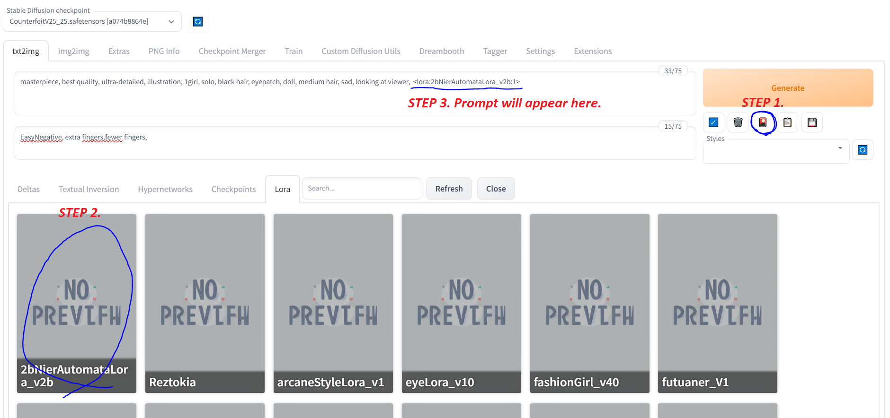

# How to use Lora

Lora is an additional model you can use to tweak your style of your output image, it can be used on top of a base model like AOM or Counterfeit

**Prompt usage example**: `<lora:2bNierAutomataLora_v2b:1>`

**Syntax**: `<lora:{lora_name}:{weight}>`

The weight of the lora can be a number between `0` to `1`. 

Putting the weight low like `0.1` means the lora will have little effect.

Putting the weight high like `1` means that there is maxium effect. (The output image will look a lot like 2b)

Experiment with a weight of `0.4` to `0.8` (sometimes if the weight is too high the output images will produce distortions or artifacts)

**Lora filepath**: `stable-diffusion-webui/models/Lora/`
