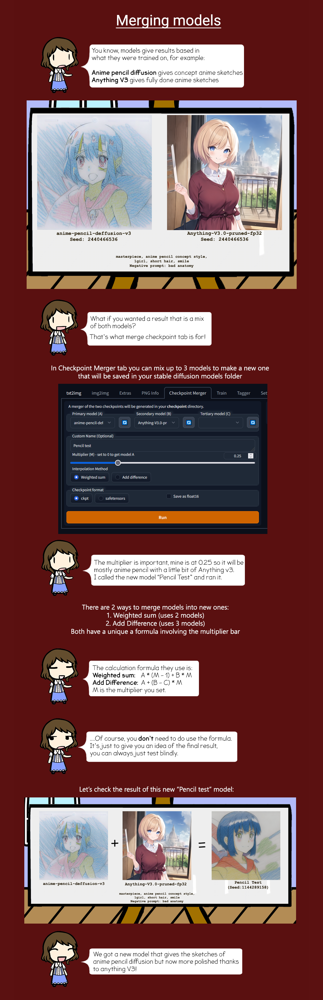

# Stable Diffusion Guide

I will be going through all the tools in stable diffusion that I think is most important/useful.

First start by launching auto1111 webui (if not already started) - `stable-diffusion-webui\webui-user.bat`

The command prompt should show `Running on local URL:  http://127.0.0.1:7860`

Copy and paste `http://127.0.0.1:7860` into your web browser

# txt2img Generation

## Basic Settings for WebUI

**Positive prompt**: what you want in your image. Default for anime models `masterpiece, best quality, ultra-detailed, illustration, 1girl`

**Negative prompt**: what you don't want in your image. Default `(worst quality, low quality:1.4)`


**Sampling method**: I still DK how this works but it affects the output. Use Default: `DPM++ SDE Karras` or experiment with the other samplers

**Sampling steps**: How many denoising steps used in the diffusion process. Generally the higher the number the better the image quality, but it takes longer to generate. Recommend leave at `20` steps, as the quality starts to flat line around there.

**Seed**: Default `-1` (meaning you use a random new seed every generation). The random noise seed that you can use as a base for diffusion, think of it as just an image with random RGB values at every coordinate pixel, this random noise image will slowly be diffused into an artwork. Different seeds produce different images.

**Batch count**: How many images you want to generate in sequence when you press `generate`. Default `1`

**Batch size**: Leave this at `1`. Increasing the size will also create more images also but it will eat up ALOT of VRAM. If you set too high you will get "CUDA OUT OF MEMORY ERROR"

**CFG scale**: Default: `8`. how much you want your image to conform with your prompt - the high the number the more it will follow the prompt

**Width & Height**: Default `512x512`. Output image dimensions. Normally set at least one side to a length between 512 & 768, the other side can be larger. If the resolution is too high, distortion and artifacts will appear in the image. If you set too high you will get "CUDA OUT OF MEMORY ERROR"

**Hires. fix**: A fix to the previous problem of distortion and artifacts. able to latently upscale images by x2 (VERY GOOD, but takes longer to generate image)

**Default settings for hires. fix**: 
- **Upscaler**: Recommend use `Latent (nearest-exact)`. I feel this is the best upscaler, unless you want to experiment with the other options.- 
- **Hires steps**: Recommend use default `0` (This means it will follow the same number of steps from the Sampling steps eg. 20)
- **Upscale by**: Recommend use default `2` (512x512 image will become 1024x1024) (setting this value too low or too high will cause distortions)

## How to reproduce previously generated images

The PNG info tab allows you to check metadata of generated image files.

You can use the samples I provided in `stable-diffusion-webui/EXAMPLES/txt2img/txt2img samples/`


This method will allow you to extract all the settings including the model used to generate the image from the metadata of the image file. 

\*Do note not all generated images will have metadata as it is up to the person who generated the image to include the metadata.

## Prompt templates - Styles

Prompt template are useful for saving prompts that you like. The alternative is just using the PNG info tab to extract the prompts from previous images, which IMO is better than Styles


## How to use Prompt Emphasis

Prompt emphasis allows you to add more weight to a specific prompt so that generated image will look more like that prompt


## Usage of "AND" for spacial composition

I'm unsure if I got this correct but...

The use of `AND` to separate prompts is useful when you are trying to generate an image with 2 separate objects in space.

For example, if you want 2 different characters in the same image you would use the prompt `Hutao AND Raiden` instead of the prompt `Hutao, Raiden`, because `Hutao, Raiden`would give you an image of a single girl blended between Hutao and Raiden.

Example:


## Using DeepBooru model to generate Danbooru tags from image

DeepBooru is a Deep Neural Network that you can interrogate to generate danbooru tags from any image.


## Optional - Using ChatGPT to generate prompts

If you are lazy to think up your own prompts...


```
Suppose I use an AI that outputs an image when I enter a prompt. For example, here is an example of a prompt that produces a beautiful image of a girl standing in a gentle breeze.
「masterpiece, best quality, ultra-detailed, illustration, 1girl, solo, sitting, an extremcly delicate and beautiful, beautiful detailed sky, eautiful detailed eye, side blunt bangs, hairsbetweeneyes, close to viewer, breeze,Fying splashes,Fying petals, wind」

 The prompt requires the following elements.
(1) Words to describe the method of depiction, such as watercolor or oil painting
(2) Words to describe external features, ornaments and belongings (also specify colors and patterns)
(3) Words to describe age, hair color, hairstyle, hair length, eye color, eye shape, facial expression, breast size, and clothing
(4) Words to describe background details
(5) Words to direct the pose from head to toe can also be added to the prompt.

Be sure to include "masterpiece, best quality, ultra-detailed, illustration, 1girl, solo," at the beginning of the prompt. Please use plain text in your response, no "" or line breaks.
Prompts may use danbooru tags. Based on these, please tell me a 150-element prompt that can generate illustrations for the following themes.
「」
```

## Lora

[Lora guide](/Lora/README.md)

# img2img generation

## ControlNet

[ControlNet & img2img guide](/img2img%20with%20controlnet/README.md)

# Model Mixing/Merging

The logic behind model mixing is to create an "inbetween" of multiple models, for example if you want to combine and 2D Anime model with a realistic 3D model to get a 2.5D model you would mix both of them together. There are other purposes as well if you want to go more in depth.



# Filepaths

**Launch file (double click)** - `stable-diffusion-webui\webui-user.bat`

**Stable Diffusion models** - `stable-diffusion-webui\models\Stable-diffusion`

**Lora models** - `stable-diffusion-webui\models\Lora`

**Output Images** - `stable-diffusion-webui\Outputs`

**Styles (prompt templates)** - `stable-diffusion-webui\styles.csv`

