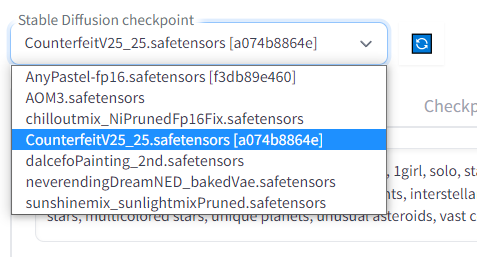

# Stable Diffusion Guide for Beginners

I will be going through all the tools in automatic1111's WebUI that I think is most important/useful.

First start by launching auto1111 webui (if not already started) - `stable-diffusion-webui\webui-user.bat`

The command prompt should show `Running on local URL:  http://127.0.0.1:7860` when it's up and running

Copy and paste `http://127.0.0.1:7860` into your web browser

# txt2img Generation

Text to Image generation comprises of taking a random noisy image and diffusing it with a text prompt

## Basic Settings for WebUI

**Positive prompt**: what you want in your image. Default for anime models `masterpiece, best quality, ultra-detailed, illustration, 1girl`

**Negative prompt**: what you don't want in your image. Default `(worst quality, low quality:1.4)`


**Sampling method**: Different samplers have different effects on the resultant image, some samplers are more creative and some more consistent, some samplers take longer to generate the image, some take shorter time. Generally, I only recommend using 2 samplers, `DPM++ SDE Karras` and `DPM++ 2M Karras`. SDE has better quality overall, but 2M is much faster.

**Sampling steps**: How many denoising steps used in the diffusion process. Generally the higher the number the better the image quality, but it takes longer to generate. Recommend leave at `20` steps, as the quality starts to flat line around there. `50` steps for the best quality

**Seed**: Default `-1` (meaning you use a random new seed every generation). The random noise seed that you can use as a base for diffusion, think of it as just an image with random RGB values at every coordinate pixel, this random noise image will slowly be diffused into an artwork. Different seeds produce different images.

**Batch count**: How many images you want to generate in sequence when you press `generate`. Default `1`

**Batch size**: Leave this at `1`. Increasing the size will also create more images also but it will eat up ALOT of VRAM. If you set too high you will get "CUDA OUT OF MEMORY ERROR"

**CFG scale**: Default: `8`. how much you want your image to conform with your prompt - the high the number the more it will follow the prompt

**Width & Height**: Default `512x512`. Output image dimensions. If the resolution is too high, distortion and artifacts will appear in the image. If you set even higher you will get "CUDA OUT OF MEMORY ERROR". Basically, your graphics card ran out of VRAM.

**Hires. fix**: A fix to the previous problem of distortion and artifacts at high resolutions by generating an image at lower resolution then upscaling the image. (Bad thing about this is takes much longer to generate image and uses more VRAM)

**Default settings for hires. fix**: 
- **Upscaler**: Recommend use `Latent (nearest-exact)`. I feel this is the best upscaler, unless you want to experiment with the other options.- 
- **Hires steps**: Recommend use default `0` (This means it will follow the same number of steps from the Sampling steps eg. 20)
- **Upscale by**: Recommend use default `2` (512x512 image will become 1024x1024) (setting this value too low or too high will cause distortions)

## Models

### How to change model

On the top left side of the UI you can swap models.



Once you swapped to a model for the first time a hash will appear beside the model. This signifies the model's fingerprint, every model will have a unique hash.

### Model ranking

This is my personal model ranking based on my own research.

1. AOM - Abyss orange mix U-net block merged model - insane japanese technology, produces semi-realistic anime feel

2. dalcefoPainting - Good realistic stylized model, produces league of legends splash art style

3. counterfeit - A good stylized 2D anime model, produces very artistic and good looking artworks

4. neverendingDreamNED - Super versatile model capable of creating anything - realistic, anime, starwars, fantasy...

5. anythingV4.5 - Good generalized anime model


## How to reproduce previously generated images

The PNG info tab allows you to check metadata of previously generated image files to extract the generation parameters.

You can send the generation parameters to txt2img tab and the UI will set all the settings for you to produce the same image, all you need to do is press generate.

\* Make sure all models have the hash like \[a074b8864e] beside the name, if not, swap to the model to calculate the hash. Models will not be automatically swapped if the hashes are not yet calculated.

You can use the samples I provided in `stable-diffusion-webui/EXAMPLES/txt2img/txt2img samples/`


This method will allow you to extract all the settings including the model used to generate the image from the metadata of the image file. 

\*Do note not all generated images will have metadata as it is up to the person who generated the image to include the metadata.

## Prompt templates - Styles

Prompt template are useful for saving prompts that you like. The alternative is just using the PNG info tab to extract the prompts from previous images, which IMO is better than Styles


## How to use Prompt Emphasis

Prompt emphasis allows you to add more weight to a specific prompt so that generated image will look more like that prompt


## Usage of "AND" for spatial composition

I'm unsure if I got this correct but...

The use of `AND` to separate prompts is useful when you are trying to generate an image with 2 separate objects in space.

For example, if you want 2 different characters in the same image you would use the prompt `Hutao AND Raiden` instead of the prompt `Hutao, Raiden`, because `Hutao, Raiden`would give you an image of a single girl blended between Hutao and Raiden.

Example:


## Using DeepBooru model to generate Danbooru tags from image

DeepBooru is a Deep Neural Network that you can interrogate to generate danbooru tags from any image.

In the img2img tab, drop any image into the img box, then click Interrogate DeepBooru. After the model has downloaded and performed inference, the generated prompts will show up in the prompt box


## Optional - Using ChatGPT to generate prompts

If you are lazy to think up your own prompts...


```
Suppose I use an AI that outputs an image when I enter a prompt. For example, here is an example of a prompt that produces a beautiful image of a girl standing in a gentle breeze.
「masterpiece, best quality, ultra-detailed, illustration, 1girl, solo, sitting, an extremcly delicate and beautiful, beautiful detailed sky, eautiful detailed eye, side blunt bangs, hairsbetweeneyes, close to viewer, breeze,Fying splashes,Fying petals, wind」

 The prompt requires the following elements.
(1) Words to describe the method of depiction, such as watercolor or oil painting
(2) Words to describe external features, ornaments and belongings (also specify colors and patterns)
(3) Words to describe age, gender, hair color, hairstyle, hair length, eye color, eye shape, facial expression, and clothing
(4) Words to describe background details
(5) Words to direct the pose from head to toe can also be added to the prompt.
(6) Words to describe the camera shot e.g. (portrait, full body, upper body, close-up, cowboy shot, dutch angle)

Be sure to include "masterpiece, best quality, ultra-detailed, illustration, 1girl, solo," at the beginning of the prompt. Please use plain text in your response, no "" or line breaks.
Prompts may use danbooru tags. Based on these, please tell me a 150-element prompt that can generate illustrations for the following themes.
「」
```

## How to use Lora models

Lora is an additional model you can use to tweak your style of your output image, it can be used on top of a base model like AOM or Counterfeit


**Prompt usage example**: `<lora:2bNierAutomataLora_v2b:1>`

**Syntax**: `<lora:{lora_name}:{weight}>`

The weight of the lora can be a number between `0` to `1`. 

Putting the weight low like `0.1` means the lora will have little effect.

Putting the weight high like `1` means that there is maxium effect. (The output image will look a lot like 2b)

Experiment with a weight of `0.4` to `0.8` (sometimes if the weight is too high the output images will produce distortions or artifacts)


**Filepath to Lora models**: `stable-diffusion-webui/models/Lora/`

# img2img generation

Image to Image generation allows for more control over the resulting image than Text to Image generation, as the base image from which is denoised is no longer a random noisy image but is an actual image.

## What is ControlNet and img2img

`ControlNet` is an advanced version of `img2img`

`img2img` allows you to create a new image that is similar looking to the original. This is done by adding a certain amount of noise (depending on your setting) to the original image and and then diffusing it fully.

&nbsp;

The flaw of `img2img` is that it needs a low denoising strength to keep the form for the original artwork. Because if there is high denoising strength the base image will just be a image with random RGB value at each coordinate, which is basically the same as using a random seed.

\*(Denosing strength is the amount of noise to add to the original artwork)

&nbsp;

ControlNet solves this by masking the sketch lines so that the final generated image conforms to those lines, 
thereby keeping the form of the original image even if the image has a high denoising strength or is a random seed.

I recommend only using the canny model for controlNet, the rest of the models are not very good

### Example of ControlNet & img2img


img2img (ControlNet)      |  inpainting (ControlNet) | img2img (normal)
:----------------:|:---------------:|:---:|
  |   | 


# Model Mixing/Merging

The logic behind model mixing is to create an "inbetween" of multiple models, for example if you want to combine and 2D Anime model with a realistic 3D model to get a 2.5D model you would mix both of them together. There is also U-net block merge which is more complicated.


# Filepaths

**Launch file (double click)** - `stable-diffusion-webui\webui-user.bat`

**Stable Diffusion models** - `stable-diffusion-webui\models\Stable-diffusion`

**Lora models** - `stable-diffusion-webui\models\Lora`

**Output Images** - `stable-diffusion-webui\Outputs`

**Styles (prompt templates)** - `stable-diffusion-webui\styles.csv`

