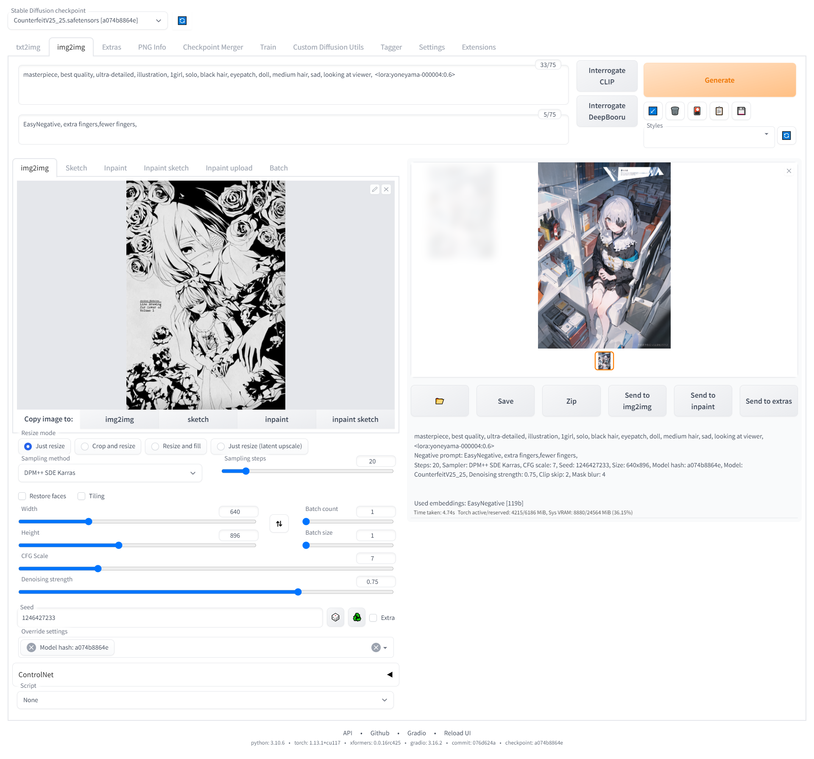

# How to use ControlNet and img2img

## What is ControlNet and img2img

`ControlNet` is an advanced version of `img2img`

`img2img` allows you to create a new image that is similar looking to the original. This is done by adding a certain amount of noise (depending on your setting) to the original image and and then diffusing it fully.

&nbsp;

The flaw of `img2img` is that it needs a low denoising strength to keep the form for the original artwork. Because if there is high denoising strength the base image will just be a image with random RGB value at each coordinate, which is basically the same as using a random seed.

\*(Denosing strength is the amount of noise to add to the original artwork)

&nbsp;

ControlNet solves this by masking the sketch lines so that the final generated image conforms to those lines, 
thereby keeping the form of the original image even if the image has a high denoising strength or is a random seed.

I recommend only using the canny model for controlNet, the rest of the models are not very good

## Example of ControlNet img2img

## Example of ControlNet Inpainting

Using the brush tool to mask out the areas of the image to inpaint

## Example of img2img without ControlNet

