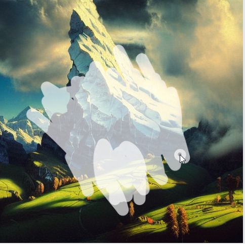
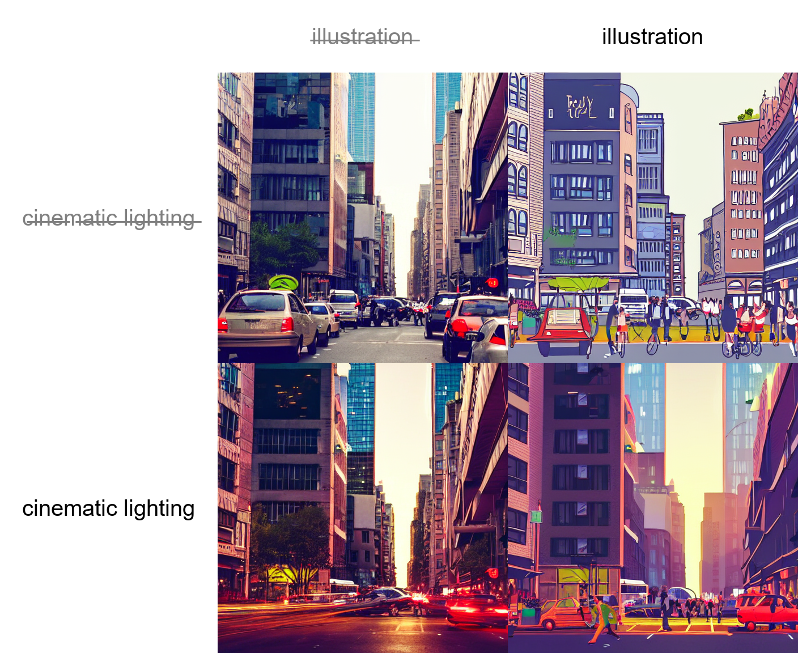

This is a feature showcase page for [Stable Diffusion web UI](https://github.com/AUTOMATIC1111/stable-diffusion-webui).

All examples are non-cherrypicked unless specified otherwise.

# SD-XL

[[PR]](https://github.com/AUTOMATIC1111/stable-diffusion-webui/pull/11757) | [[Stability-AI Github]](https://github.com/Stability-AI/generative-models) 

Support for SD-XL was added in version `1.5.0`, with additional memory optimizations and built-in sequenced refiner inference added in version `1.6.0`.

Read here for a list of tips for optimizing inference: [Optimum-SDXL-Usage](https://github.com/AUTOMATIC1111/stable-diffusion-webui/wiki/Optimum-SDXL-Usage)

## Downloads

**Two** models are available. The **first** is the **primary** model.

- [sd_xl_base_1.0_0.9vae](https://huggingface.co/stabilityai/stable-diffusion-xl-base-1.0/blob/main/sd_xl_base_1.0_0.9vae.safetensors)

- [sd_xl_refiner_1.0_0.9vae](https://huggingface.co/stabilityai/stable-diffusion-xl-refiner-1.0/blob/main/sd_xl_refiner_1.0_0.9vae.safetensors)

>~~They have a built-in trained vae by [madebyollin](https://github.com/madebyollin) which fixes NaN infinity calculations running in fp16. (Here is the most up-to-date [VAE](https://huggingface.co/madebyollin/sdxl-vae-fp16-fix/blob/main/sdxl_vae.safetensors) for reference)~~ Bad/Outdated info. Using this model will not fix fp16 issues for all models. You should merge this [VAE](https://huggingface.co/madebyollin/sdxl-vae-fp16-fix/blob/main/sdxl_vae.safetensors) with the models.

# SD-XL BASE

This is a model designed for generating quality `1024×1024`-sized images.

It's tested to produce same (or very close) images as Stability-AI's repo (need to set Random number generator source = CPU in settings)


## SD-XL REFINER 

This secondary model is **designed** to process the `1024×1024` SD-XL image **near completion**, to further enhance and refine details in your final output picture. As of version 1.6.0, this is now implemented in the webui natively.

# SD2 Variation Models
[PR](https://github.com/AUTOMATIC1111/stable-diffusion-webui/pull/8958), ([more info.](https://github.com/Stability-AI/stablediffusion/blob/main/doc/UNCLIP.MD))

support for [stable-diffusion-2-1-unclip](https://huggingface.co/stabilityai/stable-diffusion-2-1-unclip) checkpoints that are used for generating image variations. 

It works in the same way as the current support for the SD2.0 depth model, in that you run it from the img2img tab, it extracts information from the input image (in this case, CLIP or OpenCLIP embeddings), and feeds those into the model in addition to the text prompt. Normally you would do this with denoising strength set to 1.0, since you don't actually want the normal img2img behaviour to have any influence on the generated image.


# InstructPix2Pix
[Website](https://www.timothybrooks.com/instruct-pix2pix). [Checkpoint](http://instruct-pix2pix.eecs.berkeley.edu/instruct-pix2pix-00-22000.ckpt). The checkpoint is fully supported in img2img tab. No additional actions are required. Previously an [extension](https://github.com/Klace/stable-diffusion-webui-instruct-pix2pix) by a contributor was required to generate pictures: it's no longer required, but should still work. Most of img2img implementation is by the same person.

To reproduce results of the original repo, use denoising of 1.0, Euler a sampler, and edit the config in `configs/instruct-pix2pix.yaml` to say:

```
    use_ema: true
    load_ema: true
```

instead of:

```
    use_ema: false
```


# Extra networks
A single button with a picture of a card on it. It unifies multiple extra ways to extend your generation into one UI. 

Find it next to the big Generate button:


Extra networks provides a set of cards, each corresponding to a file with a part of model you either train or obtain from somewhere. Clicking the card adds the model to prompt, where it will affect generation.

| Extra network     | Directory     | File types                        | How to use in prompt     |
|-------------------|---------------|-----------------------------------|--------------------------|
| Textual Inversion | `embeddings`  | `*.pt`, images                    | embedding's filename     |
| LoRA              | `models/Lora` | `*.pt`, `*.safetensors`           | `<lora:filename:multiplier>` |
| Hypernetworks     | `models/hypernetworks`     | `*.pt`, `*.ckpt`, `*.safetensors` | `<hypernet:filename:multiplier>`                         |


## Textual Inversion
A method to fine tune weights for a token in CLIP, the language model used by Stable Diffusion, from summer 2021. [Author's site](https://textual-inversion.github.io/). Long explanation: [Textual Inversion](Textual-Inversion)

## LoRA
A method to fine tune weights for CLIP and Unet, the language model and the actual image de-noiser used by Stable Diffusion, published in 2021. [Paper](https://arxiv.org/abs/2106.09685). A good way to train LoRA is to use [kohya-ss](https://github.com/kohya-ss/sd-scripts).

Support for LoRA is built-in into the Web UI, but there is an [extension](https://github.com/kohya-ss/sd-webui-additional-networks) with original implementation by kohya-ss.

Currently, LoRA networks for Stable Diffusion 2.0+ models are not supported by Web UI.

LoRA is added to the prompt by putting the following text into any location: `<lora:filename:multiplier>`, where `filename` is the name of file with LoRA on disk, excluding extension, and `multiplier` is a number, generally from 0 to 1, that lets you choose how strongly LoRA will affect the output. LoRA cannot be added to the negative prompt.

The text for adding LoRA to the prompt, `<lora:filename:multiplier>`, is only used to enable LoRA, and is erased from prompt afterwards, so you can't do tricks with prompt editing like `[<lora:one:1.0>|<lora:two:1.0>]`. A batch with multiple different prompts will only use the LoRA from the first prompt.

### More LoRA types
Since version `1.5.0`, webui supports other network types through the built-in extension.

See the details in the [[PR]](https://github.com/AUTOMATIC1111/stable-diffusion-webui/pull/11821)

## Hypernetworks
A method to fine tune weights for CLIP and Unet, the language model and the actual image de-noiser used by Stable Diffusion, generously donated to the world by our friends at Novel AI in autumn 2022. Works in the same way as LoRA except for sharing weights for some layers. Multiplier can be used to choose how strongly the hypernetwork will affect the output.

Same rules for adding hypernetworks to the prompt apply as for LoRA: `<hypernet:filename:multiplier>`.

# Alt-Diffusion
A model trained to accept inputs in different languages.
[More info](https://arxiv.org/abs/2211.06679).
[PR](https://github.com/AUTOMATIC1111/stable-diffusion-webui/pull/5238).


- [Download](https://huggingface.co/webui/AltDiffusion-m9/tree/main) the checkpoint from huggingface. Click the down arrow to download.
- Put the file into `models/Stable-Diffusion`

<details><summary>Notes: (Click to expand:)</summary>

Mechanically, attention/emphasis mechanism is supported, but seems to have much less effect, probably due to how Alt-Diffusion is implemented. 

Clip skip is not supported, the setting is ignored.

- It is recommended to run with `--xformers.` Adding additional memory-saving flags such as `--xformers --medvram` does not work.

</details>

# Stable Diffusion 2.0

1. Download your checkpoint file from huggingface. Click the down arrow to download.
2. Put the file into `models/Stable-Diffusion`

- 768 (2.0) - ([model](https://huggingface.co/stabilityai/stable-diffusion-2/blob/main/768-v-ema.safetensors)) 
- 768 (2.1) - ([model](https://huggingface.co/webui/stable-diffusion-2-1/tree/main))
- 512 (2.0) - ([model](https://huggingface.co/stabilityai/stable-diffusion-2-base/blob/main/512-base-ema.safetensors))

<details><summary>Notes: (Click to expand:)</summary>

If 2.0 or 2.1 is generating black images, enable full precision with `--no-half` or try using the `--xformers` optimization.

_**Note:**_ SD 2.0 and 2.1 are more sensitive to FP16 numerical instability (as noted by themselves [here](https://github.com/Stability-AI/stablediffusion/commit/c12d960d1ee4f9134c2516862ef991ec52d3f59e)) due to their new cross attention module.

On fp16: [comment](https://github.com/AUTOMATIC1111/stable-diffusion-webui/issues/5503#issuecomment-1341495770) to enable, in webui-user.bat:

    @echo off

    set PYTHON=
    set GIT=
    set VENV_DIR=
    set COMMANDLINE_ARGS=your command line options
    set STABLE_DIFFUSION_COMMIT_HASH="c12d960d1ee4f9134c2516862ef991ec52d3f59e"
    set ATTN_PRECISION=fp16

    call webui.bat

</details>

## Depth Guided Model
The depth-guided model will only work in img2img tab. 
[More info](https://github.com/Stability-AI/stablediffusion#depth-conditional-stable-diffusion). [PR](https://github.com/AUTOMATIC1111/stable-diffusion-webui/pull/5542).

- 512 depth (2.0) - ([model+yaml](https://huggingface.co/webui/stable-diffusion-2-depth/tree/main)) - `.safetensors`
- 512 depth (2.0) - ([model](https://huggingface.co/stabilityai/stable-diffusion-2-depth/tree/main), [yaml](https://raw.githubusercontent.com/Stability-AI/stablediffusion/main/configs/stable-diffusion/v2-midas-inference.yaml))

## Inpainting Model SD2
Model specifically designed for inpainting trained on SD 2.0 512 base.

- 512 inpainting (2.0) - ([model+yaml](https://huggingface.co/webui/stable-diffusion-2-inpainting/tree/main)) - `.safetensors`

`inpainting_mask_weight` or inpainting conditioning mask strength works on this too.

# Outpainting

Outpainting extends the original image and inpaints the created empty space.

Example:

| Original                     | Outpainting                   | Outpainting again            |
|------------------------------|------------------------------|------------------------------|
|  |  |  |

Original image by Anonymous user from 4chan. Thank you, Anonymous user.

You can find the feature in the img2img tab at the bottom, under Script -> Poor man's outpainting.

Outpainting, unlike normal image generation, seems to profit very much from large step count. A recipe for a good outpainting is a good prompt that matches the picture, sliders for denoising and CFG scale set to max, and step count of 50 to 100 with Euler ancestral or DPM2 ancestral samplers.

| 81 steps, Euler A                   | 30 steps, Euler A                     | 10 steps, Euler A                    | 80 steps, Euler A                   |
|-------------------------------------|---------------------------------------|--------------------------------------|-------------------------------------|
|  |  |  |  |

# Inpainting
In img2img tab, draw a mask over a part of the image, and that part will be in-painted.


Options for inpainting:
- draw a mask yourself in the web editor
- erase a part of the picture in an external editor and upload a transparent picture. Any even slightly transparent areas will become part of the mask. Be aware that [some editors](https://docs.krita.org/en/reference_manual/layers_and_masks/split_alpha.html#how-to-save-a-png-texture-and-keep-color-values-in-fully-transparent-areas) save completely transparent areas as black by default.
- change mode (to the bottom right of the picture) to "Upload mask" and choose a separate black and white image for the mask (white=inpaint).

## Inpainting model
RunwayML has trained an additional model specifically designed for inpainting. This model accepts additional inputs - the initial image without noise plus the mask - and seems to be much better at the job.

Download and extra info for the model is here: https://github.com/runwayml/stable-diffusion#inpainting-with-stable-diffusion

To use the model, you must rename the checkpoint so that its filename ends in `inpainting.ckpt`, for example, `1.5-inpainting.ckpt`.

After that just select the checkpoint as you'd usually select any checkpoint and you're good to go.

## Masked content
The masked content field determines content is placed to put into the masked regions before they are inpainted. This does not represent final output, it's only a look at what's going on mid-process.

| mask                                            | fill                                            | original                                            | latent noise                                            | latent nothing                                            |
|-------------------------------------------------|-------------------------------------------------|-----------------------------------------------------|---------------------------------------------------------|-----------------------------------------------------------|
|  |  |  |  |  |

## Inpaint area
Normally, inpainting resizes the image to the target resolution specified in the UI. With `Inpaint area: Only masked` enabled, only the masked region is resized, and after processing it is pasted back to the original picture.
This allows you to work with large pictures and render the inpainted object at a much larger resolution.


| Input                               | Inpaint area: Whole picture                   | Inpaint area: Only masked       |
|-------------------------------------|----------------------------------|-----------------------------------|
|   |  |  |


## Masking mode
There are two options for masked mode:
- Inpaint masked - the region under the mask is inpainted
- Inpaint not masked - under the mask is unchanged, everything else is inpainted

## Alpha mask

| Input                        | Output                        |
|------------------------------|-------------------------------|
|  |  |

## Color Sketch
Basic coloring tool for the img2img tab. Chromium-based browsers support a dropper tool.

(this is on firefox)

# Prompt matrix
Separate multiple prompts using the `|` character, and the system will produce an image for every combination of them.
For example, if you use `a busy city street in a modern city|illustration|cinematic lighting` prompt, there are four combinations possible (first part of the prompt is always kept):

- `a busy city street in a modern city`
- `a busy city street in a modern city, illustration`
- `a busy city street in a modern city, cinematic lighting`
- `a busy city street in a modern city, illustration, cinematic lighting`

Four images will be produced, in this order, all with the same seed and each with a corresponding prompt:


Another example, this time with 5 prompts and 16 variations:


You can find the feature at the bottom, under Script -> Prompt matrix.

# Stable Diffusion upscale

> ℹ️ **Note:**
> This is not the preferred method of upscaling, as this causes SD to lose attention to the rest of the image due to tiling. It should only be used if VRAM bound, or in tandem with something like [ControlNet](https://github.com/Mikubill/sd-webui-controlnet) + the tile model. For the preferred method, see [Hires. fix](#hires-fix). 

Upscale image using RealESRGAN/ESRGAN and then go through tiles of the result, improving them with img2img.
It also has an option to let you do the upscaling part yourself in an external program, and just go through tiles with img2img.

Original idea by: https://github.com/jquesnelle/txt2imghd. This is an independent implementation.

To use this feature, select `SD upscale from the scripts dropdown selection` (img2img tab).


The input image will be upscaled to twice the original
width and height, and UI's width and height sliders specify the size of individual tiles. Because of overlap, the size of the tile can be very important: 512x512 image needs nine 512x512 tiles (because of overlap), but only
four 640x640 tiles.

Recommended parameters for upscaling:
 - Sampling method: Euler a
 - Denoising strength: 0.2, can go up to 0.4 if you feel adventurous
   - A larger denoising strength is problematic due to the fact SD upscale works in tiles, as the diffusion process is then unable to give attention to the image as a whole.

| Original                                  | RealESRGAN                                  | Topaz Gigapixel                                         | SD upscale                                  |
|-------------------------------------------|---------------------------------------------|---------------------------------------------------------|---------------------------------------------|
|  |  |  |  |
|  |  |  |  |
|   |   |   |   |

# Infinite prompt length
Typing past standard 75 tokens that Stable Diffusion usually accepts increases prompt size limit from 75 to 150. Typing past that increases prompt size further. This is done by breaking the prompt into chunks of 75 tokens, processing each independently using CLIP's Transformers neural network, and then concatenating the result before feeding into the next component of stable diffusion, the Unet.

For example, a prompt with 120 tokens would be separated into two chunks: first with 75 tokens, second with 45. Both would be padded to 75 tokens and extended with start/end tokens to 77. After passing those two chunks though CLIP, we'll have two tensors with shape of `(1, 77, 768)`. Concatenating those results in `(1, 154, 768)` tensor that is then passed to Unet without issue.

## BREAK keyword
Adding a `BREAK` keyword (must be uppercase) fills the current chunks with padding characters. Adding more text after `BREAK` text will start a new chunk.

# Attention/emphasis
Using `()` in the prompt increases the model's attention to enclosed words, and `[]` decreases it. You can combine multiple modifiers:


Cheat sheet:

 - `a (word)` - increase attention to `word` by a factor of 1.1
 - `a ((word))` - increase attention to `word` by a factor of 1.21 (= 1.1 * 1.1)
 - `a [word]` - decrease attention to `word` by a factor of 1.1
 - `a (word:1.5)` - increase attention to `word` by a factor of 1.5
 - `a (word:0.25)` - decrease attention to `word` by a factor of 4 (= 1 / 0.25)
 - `a \(word\)` - use literal `()` characters in prompt

With `()`, a weight can be specified like this: `(text:1.4)`. If the weight is not specified, it is assumed to be 1.1. Specifying weight only works with `()` not with `[]`.

If you want to use any of the literal `()[]` characters in the prompt, use the backslash to escape them: `anime_\(character\)`.

On 2022-09-29, a new implementation was added that supports escape characters and numerical weights. A downside of the new implementation is that the old one was not perfect and sometimes ate characters: "a (((farm))), daytime", for example, would become "a farm daytime" without the comma. This behavior is not shared by the new implementation which preserves all text correctly, and this means that your saved seeds may produce different pictures. For now, there is an option in settings to use the old implementation.

NAI uses my implementation from before 2022-09-29, except they have 1.05 as the multiplier and use `{}` instead of `()`. So the conversion applies:

 - their `{word}` = our `(word:1.05)`
 - their `{{word}}` = our `(word:1.1025)`
 - their `[word]` = our `(word:0.952)` (0.952 = 1/1.05)
 - their `[[word]]` = our `(word:0.907)` (0.907 = 1/1.05/1.05)


# Loopback
Selecting the loopback script in img2img allows you to automatically feed output image as input for the next batch. Equivalent to saving output image and replacing the input image with it. Batch count setting controls how many iterations of
this you get.

Usually, when doing this, you would choose one of many images for the next iteration yourself, so the usefulness
of this feature may be questionable, but I've managed to get some very nice outputs with it that I wasn't able
to get otherwise.

Example: (cherrypicked result)


Original image by Anonymous user from 4chan. Thank you, Anonymous user.

# X/Y/Z plot
Creates multiple grids of images with varying parameters. X and Y are used as the rows and columns, while the Z grid is used as a batch dimension.


Select which parameters should be shared by rows, columns and batch by using X type, Y type and Z Type fields, and input those parameters separated by comma into X/Y/Z values fields. For integer, and floating point numbers, and ranges are supported. Examples:

- Simple ranges:
  - `1-5` = 1, 2, 3, 4, 5
- Ranges with increment in bracket:
  - `1-5 (+2)` = 1, 3, 5
  - `10-5 (-3)` = 10, 7
  - `1-3 (+0.5)` = 1, 1.5, 2, 2.5, 3
- Ranges with the count in square brackets:
  - `1-10 [5]` = 1, 3, 5, 7, 10
  - `0.0-1.0 [6]` = 0.0, 0.2, 0.4, 0.6, 0.8, 1.0

### Prompt S/R
Prompt S/R is one of more difficult to understand modes of operation for X/Y Plot. S/R stands for search/replace, and that's what it does - you input a list of words or phrases, it takes the first from the list and treats it as keyword, and replaces all instances of that keyword with other entries from  the list.

For example, with prompt `a man holding an apple, 8k clean`, and Prompt S/R `an apple, a watermelon, a gun` you will get three prompts:

- `a man holding an apple, 8k clean`
- `a man holding a watermelon, 8k clean`
- `a man holding a gun, 8k clean`

The list uses the same syntax as a line in a CSV file, so if you want to include commas into your entries you have to put text in quotes and make sure there is no space between quotes and separating commas:

- `darkness, light, green, heat` - 4 items - `darkness`, `light`, `green`, `heat`
- `darkness, "light, green", heat` - WRONG - 4 items - `darkness`, `"light`, `green"`, `heat`
- `darkness,"light, green",heat` - RIGHT - 3 items - `darkness`, `light, green`, `heat`

# Prompts from file or textbox

With this script it is possible to create a list of jobs which will be executed sequentially.

Example input:

```
--prompt "photo of sunset" 
--prompt "photo of sunset" --negative_prompt "orange, pink, red, sea, water, lake" --width 1024 --height 768 --sampler_name "DPM++ 2M Karras" --steps 10 --batch_size 2 --cfg_scale 3 --seed 9
--prompt "photo of winter mountains" --steps 7 --sampler_name "DDIM"
--prompt "photo of winter mountains" --width 1024
```

Example output:


Following parameters are supported:

``` 
    "sd_model", "outpath_samples", "outpath_grids", "prompt_for_display", "prompt", "negative_prompt", "styles", "seed", "subseed_strength", "subseed", 
    "seed_resize_from_h", "seed_resize_from_w", "sampler_index", "sampler_name", "batch_size", "n_iter", "steps", "cfg_scale", "width", "height", 
    "restore_faces", "tiling", "do_not_save_samples", "do_not_save_grid"
```

# Resizing
There are three options for resizing input images in img2img mode:

- Just resize - simply resizes the source image to the target resolution, resulting in an incorrect aspect ratio
- Crop and resize - resize source image preserving aspect ratio so that entirety of target resolution is occupied by it, and crop parts that stick out
- Resize and fill - resize source image preserving aspect ratio so that it entirely fits target resolution, and fill empty space by rows/columns from the source image

Example:


# Sampling method selection
Pick out of multiple sampling methods for txt2img:


# Seed resize
This function allows you to generate images from known seeds at different resolutions. Normally, when you change resolution,
the image changes entirely, even if you keep all other parameters including seed. With seed resizing you specify the resolution of the original image, and the model will very likely produce something looking very similar to it, even at a different resolution.
In the example below, the leftmost picture is 512x512, and others are produced with exact same parameters but with larger vertical
resolution.

| Info                      | Image                         |
|---------------------------|-------------------------------|
| Seed resize not enabled   |  |
| Seed resized from 512x512 |    |

Ancestral samplers are a little worse at this than the rest.

You can find this feature by clicking the "Extra" checkbox near the seed.

# Variations
A Variation strength slider and Variation seed field allow you to specify how much the existing picture should be altered to look like a different one. At maximum strength, you will get pictures with the Variation seed, at minimum - pictures with the original Seed (except for when using ancestral samplers).


You can find this feature by clicking the "Extra" checkbox near the seed.

# Styles
Press the "Save prompt as style" button to write your current prompt to styles.csv, the file with a collection of styles. A dropbox to the right of the prompt will allow you to choose any style out of previously saved, and automatically append it to your input.
To delete a style, manually delete it from styles.csv and restart the program.

if you use the special string `{prompt}` in your style, it will substitute anything currently in the prompt into that position, rather than appending the style to your prompt.

# Negative prompt

Allows you to use another prompt of things the model should avoid when generating the picture. This works by using the negative prompt for unconditional conditioning in the sampling process instead of an empty string.

Advanced explanation: [Negative prompt](Negative-prompt)

| Original                      | Negative: purple                | Negative: tentacles                |
|-------------------------------|---------------------------------|------------------------------------|
|  |  |  |

# CLIP interrogator

Originally by: https://github.com/pharmapsychotic/clip-interrogator

CLIP interrogator allows you to retrieve the prompt from an image. The prompt won't allow you to reproduce this exact image (and sometimes it won't even be close), but it can be a good start.


The first time you run CLIP interrogator it will download a few gigabytes of models.

CLIP interrogator has two parts: one is a BLIP model that creates a text description from the picture.
Other is a CLIP model that will pick few lines relevant to the picture out of a list. By default, there is only one list - a list of artists (from `artists.csv`). You can add more lists by doing the following:

 - create `interrogate` directory in the same place as webui
 - put text files in it with a relevant description on each line

For example of what text files to use, see https://github.com/pharmapsychotic/clip-interrogator/tree/main/clip_interrogator/data.
In fact, you can just take files from there and use them - just skip artists.txt because you already have a list of artists in `artists.csv` (or use that too, who's going to stop you). Each file adds one line of text to the final description.
If you add ".top3." to filename, for example, `flavors.top3.txt`, the three most relevant lines from this file will be added to the prompt (other numbers also work).

There are settings relevant to this feature:
 - `Interrogate: keep models in VRAM` - do not unload Interrogate models from memory after using them. For users with a lot of VRAM.
 - `Interrogate: use artists from artists.csv` - adds artist from `artists.csv` when interrogating. Can be useful to disable when you have your list of artists in `interrogate` directory
 - `Interrogate: num_beams for BLIP` - parameter that affects how detailed descriptions from BLIP model are (the first part of generated prompt)
 - `Interrogate: minimum description length` - minimum length for BLIP model's text
 - `Interrogate: maximum descripton length` - maximum length for BLIP model's text
 - `Interrogate: maximum number of lines in text file` - interrogator will only consider this many first lines in a file. Set to 0, the default is 1500, which is about as much as a 4GB videocard can handle.

# Prompt editing


Prompt editing allows you to start sampling one picture, but in the middle swap to something else. The base syntax for this is:

```
[from:to:when]
```

Where `from` and `to` are arbitrary texts, and `when` is a number that defines how late in the sampling cycle should the switch be made. The later it is, the less power the model has to draw the `to` text in place of `from` text. If `when` is a number from `0.0` to `1.0`, it's a fraction of the number of steps after which to make the switch. If it's an integer (no decimal point) greater than zero, it's just the step after which to make the switch.

Nesting one prompt editing inside another also works.

Additionally:
- `[to:when]` - adds `to` to the prompt after a fixed number of steps (`when`)
- `[from::when]` - removes `from` from the prompt after a fixed number of steps (`when`)

**1.6.0 Update**: For numbers with a fractional point in a range of `1.0` to `2.0`, this now targets the second pass AKA hires fix pass. More information can be found on the [seed breaking changes page](https://github.com/AUTOMATIC1111/stable-diffusion-webui/wiki/Seed-breaking-changes#160-2023-08-24---prompt-editing-timeline-has-separate-range-for-first-pass-and-hires-fix-pass) and the [relevant PR](https://github.com/AUTOMATIC1111/stable-diffusion-webui/pull/12457).

**Example**:
`a [fantasy:cyberpunk:16] landscape`

- At start, the model will be drawing `a fantasy landscape`.
- After step 16, it will switch to drawing `a cyberpunk landscape`, continuing from where it stopped with fantasy.

Here's a more complex example with multiple edits:
`fantasy landscape with a [mountain:lake:0.25] and [an oak:a christmas tree:0.75][ in foreground::0.6][ in background:0.25] [shoddy:masterful:0.5]` (sampler has `100` steps)

- at start (step `0`), `fantasy landscape with a mountain and an oak in foreground shoddy`
- after step `25`, `fantasy landscape with a lake and an oak in foreground in background shoddy`
- after step `50`, `fantasy landscape with a lake and an oak in foreground in background masterful`
- after step `60`, `fantasy landscape with a lake and an oak in background masterful`
- after step `75`, `fantasy landscape with a lake and a christmas tree in background masterful`

The picture at the top was made with the prompt:

`Official portrait of a smiling world war ii general, [male:female:0.99], cheerful, happy, detailed face, 20th century, highly detailed, cinematic lighting, digital art painting by Greg Rutkowski`

And the number `0.99` is replaced with whatever you see in column labels on the image.

The last column in the picture is `[male:female:0.0]`, which essentially means that you are asking the model to draw a female from the start, without starting with a male general, and that is why it looks so different from others.

**Note**: This syntax does _not_ work with extra networks, such as LoRA. See [this discussion post](https://github.com/AUTOMATIC1111/stable-diffusion-webui/discussions/10897#discussioncomment-6055184) for details. For similar functionality, see the [sd-webui-loractl extension](https://github.com/cheald/sd-webui-loractl).

## Alternating Words

Convenient Syntax for swapping every other step.

    [cow|horse] in a field

On step 1, prompt is "cow in a field." Step 2 is "horse in a field." Step 3 is "cow in a field" and so on.


See more advanced example below. On step 8, the chain loops back from "man" to "cow."

    [cow|cow|horse|man|siberian tiger|ox|man] in a field

Prompt editing was first implemented by Doggettx in [this reddit post](https://www.reddit.com/r/StableDiffusion/comments/xas2os/simple_prompt2prompt_implementation_with_prompt/).

**Note**: This syntax does _not_ work with extra networks, such as LoRA. See [this discussion post](https://github.com/AUTOMATIC1111/stable-diffusion-webui/discussions/10897#discussioncomment-6055184) for details. For similar functionality, see the [sd-webui-loractl extension](https://github.com/cheald/sd-webui-loractl).

# Hires. fix
A convenience option to partially render your image at a lower resolution, upscale it, and then add details at a high resolution. In other words, this is equivalent to generating an image in txt2img, upscaling it via a method of your choice, and running a second pass on the now upscaled image in img2img to further refine the upscale and create the final result.

By default, SD1/2 based models create horrible images at very high resolutions, as these models were only trained at 512px or 768px. This method makes it possible to avoid this issue by utilizing the small picture's composition in the denoising process of the larger version. Enabled by checking the "Hires. fix" checkbox on the txt2img page.

**1.8.0 Update**: Images can now be upscaled with hires. fix as a separate process after the initial generation by clicking on the [✨] button while the relevant image is selected in the image viewer.

| Without                      | With                |
|-------------------------------|---------------------------------|
|  |  |
|  |  |

Small picture is rendered at whatever resolution you set using width/height sliders.
Large picture's dimensions are controlled by three sliders: "Scale by" multiplier (Hires upscale), "Resize width to" and/or "Resize height to" (Hires resize).

* If "Resize width to" and "Resize height to" are 0, "Scale by" is used.
* If "Resize width to" is 0, "Resize height to" is calculated from width and height.
* If "Resize height to" is 0, "Resize width to" is calculated from width and height.
* If both "Resize width to" and "Resize height to" are non-zero, image is upscaled to be at least those dimensions, and some parts are cropped.

In older versions of the webui, the final width and height were input manually (the last option listed above). In new versions, the default is to use the "Scale by" factor, which is the default and preferred.

To potentially further enhance details in hires. fix, see the notes on [extra noise](#extra-noise).

## Upscalers

A dropdown allows you to to select the kind of upscaler to use for resizing the image. In addition to all upscalers you have available on extras tab, there is an option to upscale a latent space image, which is what stable diffusion works with internally - for a 3x512x512 RGB image, its latent space representation would be 4x64x64. To see what each latent space upscaler does, you can set Denoising strength to 0 and Hires steps to 1 - you'll get a very good approximation of what stable diffusion would be working with on upscaled image.

Below are examples of how different latent upscale modes look. 

| Original                     |
|------------------------------|
|  | 

| Latent, Latent (antialiased)                     | Latent (bicubic), Latent (bicubic, antialiased) | Latent (nearest)            |
|------------------------------|------------------------------|------------------------------|
|  |  |  |

Antialiased variations were PRd in by a contributor and seem to be the same as non-antialiased.

# Composable Diffusion

A method to allow the combination of multiple prompts.
combine prompts using an uppercase AND

    a cat AND a dog

Supports weights for prompts: `a cat :1.2 AND a dog AND a penguin :2.2`
The default weight value is 1.
It can be quite useful for combining multiple embeddings to your result: `creature_embedding in the woods:0.7 AND arcane_embedding:0.5 AND glitch_embedding:0.2` 

Using a value lower than 0.1 will barely have an effect. `a cat AND a dog:0.03` will produce basically the same output as `a cat`

This could be handy for generating fine-tuned recursive variations, by continuing to append more prompts to your total. `creature_embedding on log AND frog:0.13 AND yellow eyes:0.08`


# Interrupt

Press the Interrupt button to stop current processing.

# 4GB videocard support
Optimizations for GPUs with low VRAM. This should make it possible to generate 512x512 images on videocards with 4GB memory.

`--lowvram` is a reimplementation of an optimization idea by [basujindal](https://github.com/basujindal/stable-diffusion).
Model is separated into modules, and only one module is kept in GPU memory; when another module needs to run, the previous is removed from GPU memory. The nature of this optimization makes the processing run slower -- about 10 times slower
compared to normal operation on my RTX 3090.

`--medvram` is another optimization that should reduce VRAM usage significantly by not processing conditional and
unconditional denoising in the same batch.

This implementation of optimization does not require any modification to the original Stable Diffusion code.

# TAESD

[Standard inference support added](https://github.com/AUTOMATIC1111/stable-diffusion-webui/pull/12311) in version `1.6.0`

With this lightweight VAE enabled via settings, it typically allows for very large, fast generations with a small quality loss.
This gain can be very large, maximum generations with --lowvram can increase from `1152x1152` to `2560x2560`


# Face restoration
Lets you improve faces in pictures using either [GFPGAN](https://github.com/TencentARC/GFPGAN) or [CodeFormer](https://github.com/sczhou/CodeFormer). There is a checkbox in every tab to use face restoration,
and also a separate tab that just allows you to use face restoration on any picture, with a slider that controls how visible
the effect is. You can choose between the two methods in settings.

| Original                | GFPGAN                         | CodeFormer                         |
|-------------------------|--------------------------------|------------------------------------|
|  |  |  |

# Checkpoint Merger
Guide generously donated by an anonymous benefactor.


Full guide with other info is here: https://imgur.com/a/VjFi5uM

# Saving
Click the Save button under the output section, and generated images will be saved to a directory specified in settings;
generation parameters will be appended to a csv file in the same directory.

# Loading
Gradio's loading graphic has a very negative effect on the processing speed of the neural network.
My RTX 3090 makes images about 10% faster when the tab with gradio is not active. By default, the UI now hides loading progress animation and replaces it with static "Loading..." text, which achieves the same effect. Use the `--no-progressbar-hiding` commandline option to revert this and show loading animations.

# Caching Models


If you want faster swapping between models, increase the counter in settings. Webui will keep models you've swapped from in ram. 

Make sure you set the appropriate number according to your remaining available ram. 

# Prompt validation
Stable Diffusion has a limit for input text length. If your prompt is too long, you will get a warning in the text output field, showing which parts of your text were truncated and ignored by the model.

# PNG info
Adds information about generation parameters to PNG as a text chunk. You can view this information later using any software that supports viewing PNG chunk info, for example: https://www.nayuki.io/page/png-file-chunk-inspector

# Prompt comments
Starting in [version 1.8.0](https://github.com/AUTOMATIC1111/stable-diffusion-webui/releases/tag/v1.8.0), comments are now supported and enabled by default. Comments function similarly to single-line comments in Python, using the hash symbol (`#`). When generating an image, the webui will ignore any text following a `#` symbol on the same line. Comments are not included in the PNG info of generated images.

Here's an example of how to use comments in a prompt:

```
This part of the prompt will be processed # while this part will be ignored
# This entire line is a comment and will be ignored
```

When viewing the PNG info of an image generated with the above prompt, the end-user will see:

```
This part of the prompt will be processed
```

The comments will not be visible in the PNG info, as they are only meant for the user's reference within the webui.

# Settings
A tab with settings, allows you to use UI to edit more than half of parameters that previously were commandline. Settings are saved to `config.js`. Settings that remain as commandline options are ones that are required at startup.

# Filenames format
The `Images filename pattern` field in the Settings tab allows customization of generated txt2img and img2img images filenames. This pattern defines the generation parameters you want to include in filenames and their order. The supported tags are:

`[seed], [steps], [cfg], [width], [height], [styles], [sampler], [model_hash], [model_name], [date], [datetime], [job_timestamp], [prompt_hash], [prompt], [prompt_no_styles], [prompt_spaces], [prompt_words], [batch_number], [generation_number], [hasprompt], [clip_skip], [denoising]`

This list will evolve though, with new additions. You can get an up-to-date list of supported tags by hovering your mouse over the "Images filename pattern" label in the UI.

Example of a pattern: `[seed]-[steps]-[cfg]-[sampler]-[prompt_spaces]`

Note about "prompt" tags: `[prompt]` will add underscores between the prompt words, while `[prompt_spaces]` will keep the prompt intact (easier to copy/paste into the UI again). `[prompt_words]` is a simplified and cleaned-up version of your prompt, already used to generate subdirectories names, with only the words of your prompt (no punctuation).

If you leave this field empty, the default pattern will be applied (`[seed]-[prompt_spaces]`).

Please note that the tags are actually replaced inside the pattern. It means that you can also add non-tags words to this pattern, to make filenames even more explicit. For example: `s=[seed],p=[prompt_spaces]`

# User scripts
If the program is launched with `--allow-code` option, an extra text input field for script code is available at the bottom of the page, under Scripts -> Custom code. It allows you to input python code that will do the work with the image.

In code, access parameters from web UI using the `p` variable, and provide outputs for web UI using the `display(images, seed, info)` function. All globals from the script are also accessible.

A simple script that would just process the image and output it normally:

```python
import modules.processing

processed = modules.processing.process_images(p)

print("Seed was: " + str(processed.seed))

display(processed.images, processed.seed, processed.info)
```

# UI config
You can change parameters for UI elements in `ui-config.json`, it is created automatically when the program first starts. Some options:

 - radio groups: default selection
 - sliders: default value, min, max, step
 - checkboxes: checked state
 - text and number inputs: default values

Checkboxes that would usually expand a hidden section will not initially do so when set as UI config entries.

# ESRGAN
It's possible to use ESRGAN models on the Extras tab, as well as in SD upscale. [Paper](https://arxiv.org/abs/1809.00219) here.

To use ESRGAN models, put them into ESRGAN directory in the same location as webui.py.
A file will be loaded as a model if it has .pth extension. Grab models from the [Model Database](https://upscale.wiki/wiki/Model_Database).

Not all models from the database are supported. All 2x models are most likely not supported.

# img2img alternative test
Deconstructs an input image using a reverse of the Euler diffuser to create the noise pattern used to construct the input prompt.

As an example, you can use this image. Select the img2img alternative test from the *scripts* section.


Adjust your settings for the reconstruction process:
- Use a brief description of the scene: "A smiling woman with brown hair." Describing features you want to change helps. Set this as your starting prompt, and 'Original Input Prompt' in the script settings.
- You *MUST* use the Euler sampling method, as this script is built on it.
- Sampling steps: 50-60. This MUCH match the decode steps value in the script, or you'll have a bad time. Use 50 for this demo.
- CFG scale: 2 or lower. For this demo, use 1.8. (Hint, you can edit ui-config.json to change "img2img/CFG Scale/step" to .1 instead of .5.
- Denoising strength - this *does* matter, contrary to what the old docs said. Set it to 1.
- Width/Height - Use the width/height of the input image.
- Seed...you can ignore this. The reverse Euler is generating the noise for the image now.
- Decode cfg scale - Somewhere lower than 1 is the sweet spot. For the demo, use 1.
- Decode steps - as mentioned above, this should match your sampling steps. 50 for the demo, consider increasing to 60 for more detailed images.

Once all of the above are dialed in, you should be able to hit "Generate" and get back a result that is a *very* close approximation to the original.

After validating that the script is re-generating the source photo with a good degree of accuracy, you can try to change the details of the prompt. Larger variations of the original will likely result in an image with an entirely different composition than the source.

Example outputs using the above settings and prompts below (Red hair/pony not pictured)


"A smiling woman with blue hair." Works.
"A frowning woman with brown hair." Works.
"A frowning woman with red hair." Works.
"A frowning woman with red hair riding a horse." Seems to replace the woman entirely, and now we have a ginger pony.

# Soft inpainting

To quote [CodeHatchling](https://github.com/CodeHatchling):

> Soft inpainting allows the denoiser to work directly with soft-edged (i.e. non-binary) masks, whereby unmasked content is blended seamlessly with inpainted content with gradual transitions. It is conceptually similar to per-pixel denoising strength.


This is a fully independent implementation developed specifically for the webui and was graciously provided by this user. More information can be found via the built-in help in the webui, or the [relevant PR](https://github.com/AUTOMATIC1111/stable-diffusion-webui/pull/14208).

# user.css
Create a file named `user.css` near `webui.py` and put custom CSS code into it. For example, this makes the gallery taller:

```css
#txt2img_gallery, #img2img_gallery{
    min-height: 768px;
}
```
A useful tip is you can append `/?__theme=dark` to your webui url to enable a built in *dark theme*
<br>e.g. (`http://127.0.0.1:7860/?__theme=dark`)

Alternatively, you can add the `--theme=dark` to the `set COMMANDLINE_ARGS=` in `webui-user.bat`<br>
e.g. `set COMMANDLINE_ARGS=--theme=dark`


# notification.mp3
If an audio file named `notification.mp3` is present in webui's root folder, it will be played when the generation process completes.

As a source of inspiration:
* https://pixabay.com/sound-effects/search/ding/?duration=0-30
* https://pixabay.com/sound-effects/search/notification/?duration=0-30

# Tweaks

## Clip Skip
This is a slider in settings, and it controls how early the processing of prompt by CLIP network should be stopped.

A more detailed explanation:

CLIP is a very advanced neural network that transforms your prompt text into a numerical representation. Neural networks work very well with this numerical representation and that's why devs of SD chose CLIP as one of 3 models involved in stable diffusion's method of producing images. As CLIP is a neural network, it means that it has a lot of layers. Your prompt is digitized in a simple way, and then fed through layers. You get numerical representation of the prompt after the 1st layer, you feed that into the second layer, you feed the result of that into third, etc, until you get to the last layer, and that's the output of CLIP that is used in stable diffusion. This is the slider value of 1. But you can stop early, and use the output of the next to last layer - that's slider value of 2. The earlier you stop, the less layers of neural network have worked on the prompt.

Some models were trained with this kind of tweak, so setting this value helps produce better results on those models.

**Note**: All SDXL models are trained with the next to last (penultimate) layer. This is why Clip Skip intentionally does not change the result of the model, as it would simply make the result worse. The option is only provided due to the fact early SDv1 models do not provide any way to determine the correct layer to use.

## Extra noise
Adds additional noise from the random seed, determined by the setting, defaulting to `0`. Implemented in version 1.6.0 via [#12564](https://github.com/AUTOMATIC1111/stable-diffusion-webui/pull/12564), available in settings under `img2img` -> `Extra noise multiplier for img2img and hires fix`. As noted in the UI, **this parameter should always be lower than the denoising strength used to yield the best results**.

One purpose for this tweak is to add back additional detail into hires fix. For a very simplified understanding, you may think of it as a cross between GAN upscaling and latent upscaling.

The below example is of a 512x512 image with hires fix applied, using a GAN upscaler (4x-UltraSharp), at a denoising strength of 0.45. The image on the right utilizes this extra noise tweak.
Extra noise = 0             |  Extra noise = 0.2
:-------------------------:|:-------------------------:
[](https://user-images.githubusercontent.com/122327233/260556373-9257aa18-dfc8-49f6-9984-a0a1f430c029.png)  |  [](https://user-images.githubusercontent.com/122327233/260556387-0c6df12c-7412-43d5-84d2-2a69ad6152c4.png)

Note that the previous setting implemented at the time many months ago (`Noise multiplier for img2img`) technically achieves the same effect, but as noted in the name *only* applies to img2img (not hires. fix), and due to it was implemented it is very sensitive, realisticly only useful in a range of `1` to `1.1`. For almost all operations it would be suggested to use the new `Extra noise` parameter instead.

For developers, a callback also exists (`on_extra_noise`). Here is an example of use that makes the region to add noise to maskable. https://gist.github.com/catboxanon/69ce64e0389fa803d26dc59bb444af53