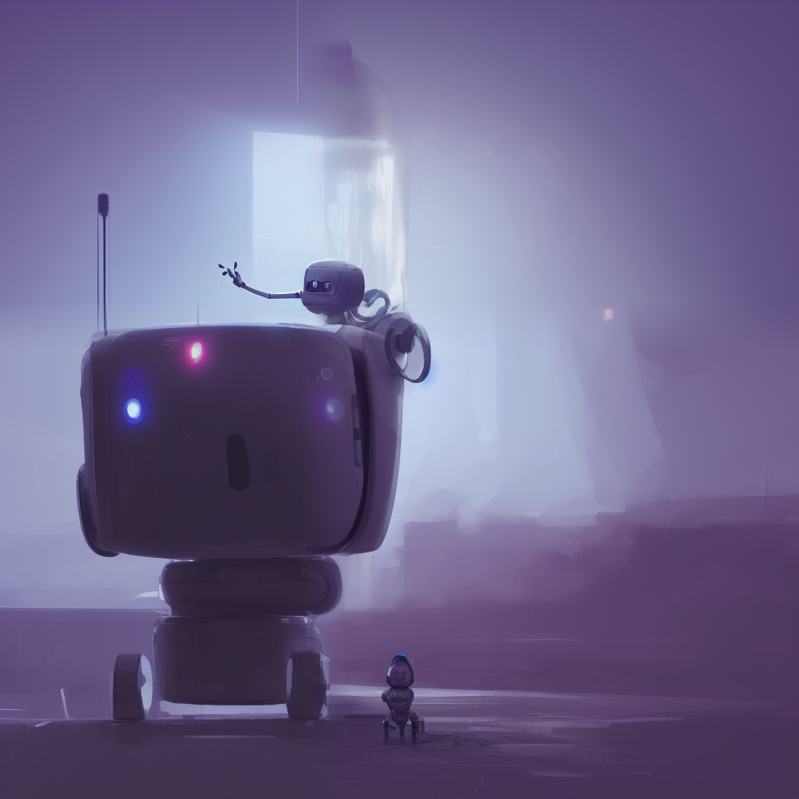

This is a feature showcase page for [Stable Diffusion web UI](https://github.com/AUTOMATIC1111/stable-diffusion-webui).

All examples are non-cherrypicked unless specified otherwise.

# Outpainting

Outpainting extends original image and inpaints  created empty space.

Example:

| Original                     | Oupainting                   | Outpainting again            |
|------------------------------|------------------------------|------------------------------|
|  |  |  |

Original image by Anonymous user from 4chan. Thank you, Anonymous user.

You can find the feature in the img2img tab at the bottom, under Script -> Poor man's outpainting.

Outpainting, unlike normal image generation, seems to profit very much from large step count. A recipe for a good outpainting
is a good prompt that matches the picture, sliders for denoising and FCG scale set to max, and step count of 50 to 100 with
euler ancestral or DPM2 ancestral samplers.

| 81 steps, Euler A                   | 30 steps, Euler A                     | 10 steps, Euler A                    | 80 steps, Euler A                   |
|-------------------------------------|---------------------------------------|--------------------------------------|-------------------------------------|
|  |  |  |  |

# Inpainting
In img2img tab, draw a mask over a part of image, and that part will be in-painted.


Options for inpainting:
- draw a mask yourself in web editor
- erase a part of picture in external editor and upload a transparent picture. Any even slightly transparent areas will become part of the mask. Be aware that [some editors](https://docs.krita.org/en/reference_manual/layers_and_masks/split_alpha.html#how-to-save-a-png-texture-and-keep-color-values-in-fully-transparent-areas) save completely transparent areas as black by default.
- change mode (to the bottom right of the picture) to "Upload mask" and choose a separate black and while image for mask (white=inpaint).

## Masked content
Masked content field determines content is placed to put into the masked regions before thet are inpainted.

| mask                                            | fill                                            | original                                            | latent noise                                            | latent nothing                                            |
|-------------------------------------------------|-------------------------------------------------|-----------------------------------------------------|---------------------------------------------------------|-----------------------------------------------------------|
|  |  |  |  |  |

## Inpaint at full resolution
Normally, inpaiting resizes the image to target resolution specified in the UI. With Inpaint at full resolution
enabled, only the masked region is resized, and after processing it is pasted back to the original picture.
This allows you to work with large pictures, and allows to render the inpained object at a much larger resolution.


| Input                               | Inpaint normal                   | Inpaint at whole resolution       |
|-------------------------------------|----------------------------------|-----------------------------------|
|   |  |  |


## Masking mode
There are two options for masked mode:
- Inpaint masked - the region under the mask is inpainted
- Inpaint not masked - under the mask is unchanged, everything else is inpainted

## Alpha mask

| Input                        | Output                        |
|------------------------------|-------------------------------|
|  |  |


# Prompt matrix
Separate multiple prompts using the `|` character, and the system will produce an image for every combination of them.
For example, if you use `a busy city street in a modern city|illustration|cinematic lighting` prompt, there are four combinations possible (first part of prompt is always kept):

- `a busy city street in a modern city`
- `a busy city street in a modern city, illustration`
- `a busy city street in a modern city, cinematic lighting`
- `a busy city street in a modern city, illustration, cinematic lighting`

Four images will be produced, in this order, all with same seed and each with corresponding prompt:


Another example, this time with 5 prompts and 16 variations:


You can find the feature at the bottom, under Script -> Prompt matrix.

# Stable Diffusion upscale
Upscale image using RealESRGAN/ESRGAN and then go through tiles of the result, improving them with img2img.
Also has an let you do the upscaling part yourself in external program, and just go through tiles with img2img.

Original idea by: https://github.com/jquesnelle/txt2imghd. This is an independent implementation.

To use this feature, tick a checkbox in the img2img interface. Input image will be upscaled to twice the original
width and height, and UI's width and height sliders specify the size of individual tiles. Because of overlap,
the size of tile can be very important: 512x512 image needs nine 512x512 tiles (because of overlap), but only
four 640x640 tiles.

Rcommended parameters for upscaling:
 - Sampling method: Euler a
 - Denoising strength: 0.2, can go up to 0.4 if you feel adventureous

| Original                                  | RealESRGAN                                  | Topaz Gigapixel                                         | SD upscale                                  |
|-------------------------------------------|---------------------------------------------|---------------------------------------------------------|---------------------------------------------|
|  |  |  |  |
|  |  |  |  |
|   |   |   |   |

# Attention
Using `()` in prompt increases model's attention to enclosed words, and `[]` decreases it. You can combine
multiple modifiers:


# Loopback
A checkbox for img2img allowing to automatically feed output image as input for the next batch. Equivalent to
saving output image, and replacing input image with it. Batch count setting controls how many iterations of
this you get.

Usually, when doing this, you would choose one of many images for the next iteration yourself, so the usefulness
of this feature may be questionable, but I've managed to get some very nice outputs with it that I wasn't abble
to get otherwise.

Example: (cherrypicked result)


Original image by Anonymous user from 4chan. Thank you, Anonymous user.

# X/Y plot
Creates a grid of images with varying parameters. Select which parameters should be shared by rows and columns using
X type and Y type fields, and input those parameters separated by comma into X values/Y values fields. For integer,
and floating ponit numbers, ranges are supported. Examples:

- `1-5` = 1, 2, 3, 4, 5
- `1-5 (+2)` = 1, 3, 5
- `10-5 (-3)` = 10, 7
- `1-3 (+0.5)` = 1, 1.5, 2, 2.5, 3


Here's are settings that create the graph above:


# Textual Inversion
Allows you to use pretrained textual inversion embeddings.
See original site for details: https://textual-inversion.github.io/.
I used lstein's repo for training embdedding: https://github.com/lstein/stable-diffusion; if
you want to train your own, I recommend following the guide on his site.

To make use of pretrained embeddings, create `embeddings` directory in the root dir of Stable
Diffusion and put your embeddings into it. They must be .pt files about 5Kb in size, each with only
one trained embedding, and the filename (without .pt) will be the term you'd use in prompt
to get that embedding.

As an example, I trained one for about 5000 steps: https://files.catbox.moe/e2ui6r.pt; it does
not produce very good results, but it does work. Download and rename it to `Usada Pekora.pt`,
and put it into `embeddings` dir and use Usada Pekora in prompt.


# Resizing
There are three options for resizing input images in img2img mode:

- Just resize - simply resizes source image to target resolution, resulting in incorrect aspect ratio
- Crop and resize - resize source image preserving aspect ratio so that entirety of target resolution is occupied by it, and crop parts that stick out
- Resize and fill - resize source image preserving aspect ratio so that it entirely fits target resolution, and fill empty space by rows/columns from source image

Example:


# Sampling method selection
Pick out of multiple sampling methods for txt2img:


# Seed resize
This function allows you to generate images from known seeds at different resolutions. Normally, when you change resolution,
the image changes entirely, even if you keep all other parameters including seed. With seed resizing you specify the resolution
of the original image, and the model will very likely produce something looking very similar to it, even at a different resolution.
In the example below, the leftmost picture is 512x512, and others are produced with exact same parameters but with larger vertical
resolution.

| Info                      | Image                         |
|---------------------------|-------------------------------|
| Seed resize not enabled   |  |
| Seed resized from 512x512 |    |

Ancestral samplers are a little worse at this than the rest.

You can find this ferature by clicking the "Extra" checkbox near the seed.

# Variations
A Variation strength slider and Variation seed field allow you to specify how much the existing picture should be altered to look
like a different one. At maximum strength you will get picture with Variation seed, at minimum -  picture with original Seed (except
for when using ancestral samplers).


You can find this ferature by clicking the "Extra" checkbox near the seed.

# Styles
Press "Save prompt as style" button to write your current prompt to styles.csv, the file with collection of styles. A dropbox to
the right of the prompt will allow you to choose any style out of previously saved, and automatically append it to your input.
To delete style, manually delete it from styles.csv and restart the program.

# Negative prompt

Allows you to use another prompt of things the model should avoid when generating the picture. This works by using the
negative prompt for unconditional conditioning in the sampling process instead of empty string.

| Original                      | Negative: purple                | Negative: tentacles                |
|-------------------------------|---------------------------------|------------------------------------|
|  |  |  |

# CLIP interrogator

Originally by: https://github.com/pharmapsychotic/clip-interrogator

CLIP interrogator allows you to retrieve prompt from an image. The prompt won't allow you to reproduce this
exact image (and sometimes it won't even be close), but it can be a good start.


The first time you run CLIP interrogator it will download few gigabytes of models.

CLIP interrogator has two parts: one is a BLIP model that creates a text description from the picture.
Other is a CLIP model that will pick few lines relevant to the picture out of a list. By default, there
is only one list - a list of artists (from `artists.csv`). You can add more lists by doing the follwoing:

 - create `interrogate` directory in same place as web ui
 - put text files in it with a relevant description on each line

For example of what text files to use, see https://github.com/pharmapsychotic/clip-interrogator/tree/main/data.
In fact, you can just take files from there and use them - just skip artists.txt because you already have a list of
artists in `artists.csv` (or use that too, who's going to stop you). Each file adds one line of text to final description.
If you add ".top3." to filename, for example, `flavors.top3.txt`, three most relevant lines from this file will be
added to the prompt (other numbers also work).

There are settings relevant to this feature:
 - `Interrogate: keep models in VRAM` - do not unload Interrogate models from memory after using them. For users with a lot of VRAM.
 - `Interrogate: use artists from artists.csv` - adds artist from `artists.csv` when interrogating. Can be useful disable when you have your list of artists in `interrogate` directory
 - `Interrogate: num_beams for BLIP` - parameter that affects how detailed descriptions from BLIP model are (the first part of generated prompt)
 - `Interrogate: minimum descripton length` - minimum length for BLIP model's text
 - `Interrogate: maximum descripton length` - maximum length for BLIP model's text
 - `Interrogate: maximum number of lines in text file` - interrogator will only consider this many first lines in a file. Set to 0, default is 1500, which is about as much as a 4GB videocard can handle.

# Prompt editing


Prompt editing allows you to start sampling one picture, but in the middle swap to something else. The base syntax for this is:

```
[from:to:when]
```

Where `from` and `to` are arbitrary texts, and `when` is a number the defines how late in the sampling cycle should the switch be made. The later it is, the less power the model has to draw the `to` text in place of `from` text. If `when` is a number between 0 and 1, it's a fraction of the number of steps after which to make the switch. If it's integer greater than zero, it's just the step after which to make the switch.

Additionally:
- `[to:when]` - adds `to` toprompt after a fixed number of steps (`when`)
- `[from::when]` - removes `from` from prompt after a fixed number of steps (`when`)

For example, here's how a prompt `fantasy landscape with a [mountain:lake:0.25] and [an oak:a christmas tree:0.75][ in foreground::0.6][ in background:0.25] [shoddy:masterful:0.5]` will look to sampler with 100 steps:

at start, `fantasy landscape with a mountain and an oak in foreground shoddy`
after step 25, `fantasy landscape with a lake and an oak in foreground in background shoddy`
after step 50, `fantasy landscape with a lake and an oak in foreground in background masterful`
after step 60, `fantasy landscape with a lake and an oak in background masterful`
after step 75, `fantasy landscape with a lake and a christmas tree in background masterful`

The picture at the op was made with prompt:

`Official portrait of a smiling world war ii general, [male:female:0.99], cheerful, happy, detailed face, 20th century, highly detailed, cinematic lighting, digital art painting by greg rutkowski`

And the number 0.99 was replaced with whatever you see in column labels on the image.

# Interrupt

Press the Interrupt button to stop current processing.

# 4GB videocard support
Optimizations for GPUs with low VRAM. This should make it possible to generate 512x512 images on videocards with 4GB memory.

`--lowvram` is a reimplementation of optimization idea from by [basujindal](https://github.com/basujindal/stable-diffusion).
Model is separated into modules, and only one module is kept in GPU memory; when another module needs to run, the previous
is removed from GPU memory. The nature of this optimization makes the processing run slower -- about 10 times slower
compared to normal operation on my RTX 3090.

`--medvram` is another optimization that should reduce VRAM usage significantly by not processing conditional and
unconditional denoising in a same batch.

This implementation of optimization does not require any modification to original Stable Diffusion code.

# Face restoration
Lets you improve faces in pictures using either GFPGAN or CodeFormer. There is a checkbox in every tab to use face restoration,
and also a separate tab that just allows you to use face restoration on any picture, with a slider that controls how visible
the effect is. You can choose between the two methods in settings.

| Original                | GFPGAN                         | CodeFormer                         |
|-------------------------|--------------------------------|------------------------------------|
|  |  |  |


# Saving
Click the Save button under the output section, and generated images will be saved to a directory specified in settings;
generation parameters will be appended to a csv file  in the same directory.

# Correct seeds for batches
If you use a seed of 1000 to generate two batches of two images each, four generated images will have seeds: `1000, 1001, 1002, 1003`.
Previous versions of the UI would produce `1000, x, 1001, x`, where x is an image that can't be generated by any seed.

# Loading
Gradio's loading graphic has a very negative effect on the processing speed of the neural network.
My RTX 3090 makes images about 10% faster when the tab with gradio is not active. By default, the UI
now hides loading progress animation and replaces it with static "Loading..." text, which achieves
the same effect. Use the `--no-progressbar-hiding` commandline option to revert this and show loading animations.

# Prompt validation
Stable Diffusion has a limit for input text length. If your prompt is too long, you will get a
warning in the text output field, showing which parts of your text were truncated and ignored by the model.

# Png info
Adds information about generation parameters to PNG as a text chunk. You
can view this information later using any software that supports viewing
PNG chunk info, for example: https://www.nayuki.io/page/png-file-chunk-inspector

# Settings
A tab with settings, allowing you to use UI to edit more than half of parameters that previously
were commandline. Settings are saved to config.js file. Settings that remain as commandline
options are ones that are required at startup.

# User scripts
If the program is launched with `--allow-code` option, an extra text input field for script code
is available in the bottom of the page, under Scripts -> Custom code. It allows you to input python
code that will do the work with the image.

In code, access parameters from web UI using the `p` variable, and provide outputs for web UI
using the `display(images, seed, info)` function. All globals from script are also accessible.

A simple script that would just process the image and output it normally:

```python
import modules.processing

processed = modules.processing.process_images(p)

print("Seed was: " + str(processed.seed))

display(processed.images, processed.seed, processed.info)
```

# UI config
You can change parameters for UI elements:
 - radio groups: default selection
 - sliders: defaul value, min, max, step

The file is ui-config.json in webui dir, and it is created automatically if you don't have one when the program starts.

Some settings will break processing, like step not divisible by 64 for width and heght, and some, like changing default
function on the img2img tab, may break UI. I do not have plans to address those in near future.

# ESRGAN
It's possible to use ESRGAN models on the Extras tab, as well as in SD upscale.

To use ESRGAN models, put them into ESRGAN directory in the same location as webui.py.
A file will be loaded as model if it has .pth extension. Grab models from the [Model Database](https://upscale.wiki/wiki/Model_Database).

Not all models from the database are supported. All 2x models are most likely not supported.

# img2img alternative test
- see [this post](https://www.reddit.com/r/StableDiffusion/comments/xboy90/a_better_way_of_doing_img2img_by_finding_the/) on ebaumsworld.com for context.
- find it in scripts section
- put description of input image into the Original prompt field
- use Euler only
- recommended: 50 steps, low cfg scale between 1 and 2
- denoising and seed don't matter
- decode cfg scale between 0 and 1
- decode steps 50
- original blue haired woman close nearly reproduces with cfg scale=1.8
