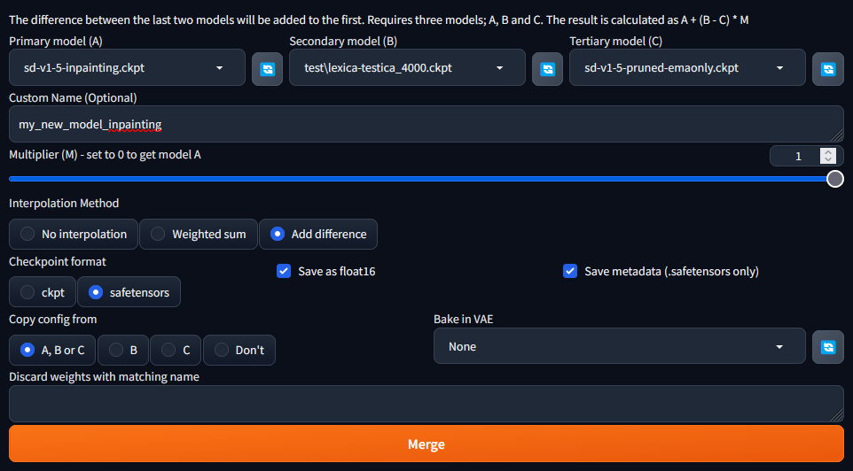

Making your own inpainting model is very simple:

1. Go to Checkpoint Merger
2. Select "Add Difference"
3. Set "Multiplier" to 1.0
4. Set "A" to the official inpaint model ([SD-v1.5-Inpainting](https://huggingface.co/runwayml/stable-diffusion-inpainting/tree/main))
5. Set "B" to your model
6. Set "C" to the standard base model ([SD-v1.5](https://huggingface.co/runwayml/stable-diffusion-v1-5/tree/main))
7. Set name as whatever you want, probably (your model)_inpainting
8. Set other values as preferred, ie probably select "Safetensors" and "Save as float16"
9. Hit merge
10. Use your new model in img2img inpainting tab

The way this works is it literally just takes the inpainting model, and copies over your model's unique data to it.
Notice that the formula is A + (B - C), which you can interpret as equivalent to (A - C) + B. Because 'A' is 1.5-inpaint and 'C' is 1.5, A - C is inpainting logic and nothing more. so the formula is (Inpainting logic) + (Your Model).

### Wider Application

This "add-the-difference" merging can be applied to almost all the **mechanically unique** models webui can load. \
 Check them out on the [Features](https://github.com/AUTOMATIC1111/stable-diffusion-webui/wiki/Features) page!

#1 Your existing **finetuned model** will need to match the **unique model's** architecture, either: Stable Diffusion 2, or 1. 

#2 You also need to put the unique model against the base model. 
Find out what was the base model from their github.

Q: what was altdiffusion-m9 using as base model? \
A: the stable diffusion 1.4 model

Q: what was instructpix2pix using as base model? \
A: the stable diffusion 1.5 model

The networks/properties of these models can be used with any finetune, just like how the famous controlnet networks apply, only these are not separated from the model.

 Notes: 

_You might realize Controlnet networks can already do many of these things._ 

So, here are some things maybe worth trying:

-darker/brighter lighting with noise offset model \
-make similar pictures to 512x512 in smaller 256 or 320 dimensions with miniSD model \
-prompt more deterministic across input languages with altdiffusion-m9 model (changes clip model)

