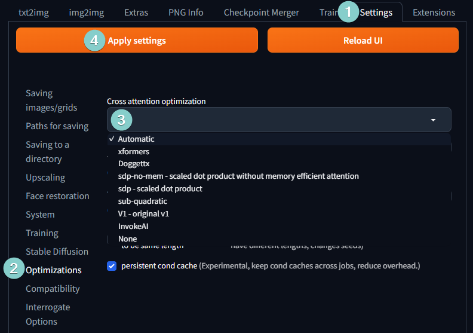

A number of optimization can be enabled by [commandline arguments](Command-Line-Arguments-And-Settings):

| commandline argument           | explanation                                                                                                                                                                                                                                                                                                                                                                                                                          |
|--------------------------------|--------------------------------------------------------------------------------------------------------------------------------------------------------------------------------------------------------------------------------------------------------------------------------------------------------------------------------------------------------------------------------------------------------------------------------------|
| `--opt-sdp-attention`           | May results in faster speeds than using xFormers on some systems but requires more VRAM. (non-deterministic)
| `--opt-sdp-no-mem-attention`           | May results in faster speeds than using xFormers on some systems but requires more VRAM. (deterministic, slightly slower than `--opt-sdp-attention` and uses more VRAM)
| `--xformers`                   | Use [xFormers](https://github.com/facebookresearch/xformers) library. Great improvement to memory consumption and speed. Nvidia GPUs only. ([deterministic as of 0.0.19](https://github.com/facebookresearch/xformers/releases/tag/v0.0.19) [webui uses 0.0.20 as of 1.4.0])                                                                    |
| `--force-enable-xformers`      | Enables xFormers regardless of whether the program thinks you can run it or not. Do not report bugs you get running this.                                                                                                                                                                                                                                                                                                      |
| `--opt-split-attention`        | Cross attention layer optimization significantly reducing memory use for almost no cost (some report improved performance with it).  Black magic.  On by default for `torch.cuda`, which includes both NVidia and AMD cards.                                                                                                                                                                                                     |
| `--disable-opt-split-attention` | Disables the optimization above.                                                                                                                                                                                                                                                                                                                                                                                                     |
| `--opt-sub-quad-attention`     | Sub-quadratic attention, a memory efficient Cross Attention layer optimization that can significantly reduce required memory, sometimes at a slight performance cost. Recommended if getting poor performance or failed generations with a hardware/software configuration that xFormers doesn't work for. On macOS, this will also allow for generation of larger images.                                                                                                                                                                    |
| `--opt-split-attention-v1`     | Uses an older version of the optimization above that is not as memory hungry (it will use less VRAM, but will be more limiting in the maximum size of pictures you can make).                                                                                                                                                                                                                                                        |
| `--medvram`                    | Makes the Stable Diffusion model consume less VRAM by splitting it into three parts - cond (for transforming text into numerical representation), first_stage (for converting a picture into latent space and back), and unet (for actual denoising of latent space) and making it so that only one is in VRAM at all times, sending others to CPU RAM. Lowers performance, but only by a bit - except if live previews are enabled. |
| `--lowvram`                    | An even more thorough optimization of the above, splitting unet into many modules, and only one module is kept in VRAM. Devastating for performance.                                                                                                                                                                                                                                                                                 |
| `*do-not-batch-cond-uncond`    | Only before 1.6.0: prevents batching of positive and negative prompts during sampling, which essentially lets you run at 0.5 batch size, saving a lot of memory. Decreases performance. Not a command line option, but an optimization implicitly enabled by using `--medvram` or `--lowvram`. In 1.6.0, this optimization is not enabled by any command line flags, and is instead enabled by default. It can be disabled in settings, `Batch cond/uncond` option in `Optimizations` category.                                                                                                                                                          |
| `--always-batch-cond-uncond`   | Only before 1.6.0: disables the optimization above. Only makes sense together with `--medvram` or `--lowvram`. In 1.6.0, this command line flag does nothing.                                                                                                                                                                                                                                                                                                                                           |
| `--opt-channelslast`           | Changes torch memory type for stable diffusion to channels last. Effects not closely studied.                                                                                                                                                                                                                                                                                                                                        |
| `--upcast-sampling`           | For Nvidia and AMD cards normally forced to run with `--no-half`, [should improve generation speed](https://github.com/AUTOMATIC1111/stable-diffusion-webui/pull/8782).    
                                                                                                                                                                                                                                                                                                                                      
As of [version 1.3.0](https://github.com/AUTOMATIC1111/stable-diffusion-webui/releases/tag/v1.3.0), `Cross attention optimization` can be selected under settings. xFormers still needs to enabled via `COMMANDLINE_ARGS`.

Extra tips (Windows): 
- https://github.com/AUTOMATIC1111/stable-diffusion-webui/discussions/3889 Disable Hardware GPU scheduling.
- disable browser hardware acceleration
- Go in nvidia control panel, 3d parameters, and change power profile to "maximum performance"

## Memory & Performance Impact of Optimizers and Flags

*This is an example test using specific hardware and configuration, your mileage may vary*  
*Tested using nVidia RTX3060 and CUDA 11.7*

| Cross-attention | Peak Memory at Batch size 1/2/4/8/16 | Initial It/s | Peak It/s | Note |
| --------------- | ------------------------------------ | -------- | --------- | ---- |
| None            | 4.1 / 6.2 / OOM / OOM / OOM | 4.2 | 4.6 | slow and early out-of-memory
| v1              | 2.8 / 2.8 / 2.8 / 3.1 / 4.1 | 4.1 | 4.7 | slow but lowest memory usage and does not require sometimes problematic xFormers
| InvokeAI        | 3.1 / 4.2 / 6.3 / 6.6 / 7.0 | 5.5 | 6.6 | almost identical to default optimizer
| Doggetx         | 3.1 / 4.2 / 6.3 / 6.6 / 7.1 | 5.4 | 6.6 | default |
| Doggetx         | 2.2 / 2.7 / 3.8 / 5.9 / 6.2 | 4.1 | 6.3 | using `medvram` preset result in decent memory savings without huge performance hit
| Doggetx         | 0.9 / 1.1 / 2.2 / 4.3 / 6.4 | 1.0 | 6.3 | using `lowvram` preset is extremely slow due to constant swapping
| xFormers        | 2.8 / 2.8 / 2.8 / 3.1 / 4.1 | 6.5 | 7.5 | fastest and low memory
| xFormers        | 2.9 / 2.9 / 2.9 / 3.6 / 4.1 | 6.4 | 7.6 | with `cuda_alloc_conf` and `opt-channelslast`

Notes:
- Performance at batch-size 1 is around **~70%** of peak performance  
- Peak performance is typically around batch size 8  
  After that it grows by few percent if you have extra VRAM before it starts to drop due to GC kicking in  
- Performance with `lowvram` preset is very low below batch size 8 and by then memory savings are not that big  

Other possible optimizations:
- adding `set PYTORCH_CUDA_ALLOC_CONF=garbage_collection_threshold:0.9,max_split_size_mb:512` in `webui-user.bat`  
  No performance impact and increases initial memory footprint a bit but reduces memory fragmentation in long runs  
- `opt-channelslast`  
  Hit-and-miss: seems like additional slight performance increase with higher batch sizes and slower with small sizes, but differences are within margin-of-error  
