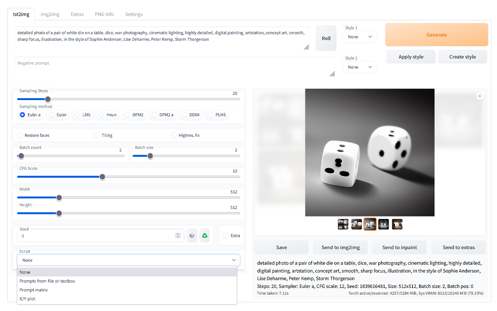

# Stable Diffusion web UI
A browser interface based on Gradio library for Stable Diffusion.



## Features
[Detailed feature showcase with images](https://github.com/AUTOMATIC1111/stable-diffusion-webui/wiki/Features):
- Original txt2img and img2img modes
- One click install and run script (but you still must install python and git)
- Outpainting
- Inpainting
- Prompt matrix
- Stable Diffusion upscale
- Attention
- Loopback
- X/Y plot
- Textual Inversion
- Extras tab with:
    - GFPGAN, neural network that fixes faces
    - CodeFormer, face restoration tool as an alternative to GFPGAN
    - RealESRGAN, neural network upscaler
    - ESRGAN, neural network with a lot of third party models
    - SwinIR, neural network upscaler
    - LDSR, Latent diffusion super resolution upscaling
- Resizing aspect ratio options
- Sampling method selection
- Interrupt processing at any time
- 4GB video card support
- Correct seeds for batches
- Prompt length validation
- Generation parameters added as text to PNG
- Tab to view an existing picture's generation parameters
- Settings page
- Running custom code from UI
- Mouseover hints for most UI elements
- Possible to change defaults/mix/max/step values for UI elements via text config
- Random artist button
- Tiling support: UI checkbox to create images that can be tiled like textures
- Progress bar and live image generation preview
- Negative prompt
- Styles
- Variations
- Seed resizing
- CLIP interrogator
- Prompt Editing
- Batch Processing
- Img2img Alternative
- Highres Fix
- LDSR Upscaling

## Installation and Running
Make sure the required [dependencies](https://github.com/AUTOMATIC1111/stable-diffusion-webui/wiki/Dependencies) are met and follow the instructions available for both [NVidia](https://github.com/AUTOMATIC1111/stable-diffusion-webui/wiki/Install-and-Run-on-NVidia-GPUs) (recommended) and [AMD](https://github.com/AUTOMATIC1111/stable-diffusion-webui/wiki/Install-and-Run-on-AMD-GPUs) GPUs.

Alternatively, use Google Colab:

- [Colab, maintained by Akaibu](https://colab.research.google.com/drive/1kw3egmSn-KgWsikYvOMjJkVDsPLjEMzl)
- [Colab, original by me, outdated](https://colab.research.google.com/drive/1Iy-xW9t1-OQWhb0hNxueGij8phCyluOh).

### Automatic Installation on Windows
1. Install [Python 3.10.6](https://www.python.org/downloads/windows/), checking "Add Python to PATH"
2. Install [git](https://git-scm.com/download/win).
3. Download the stable-diffusion-webui repository, for example by running `git clone https://github.com/AUTOMATIC1111/stable-diffusion-webui.git`.
4. Place `model.ckpt` in the `models` directory (see [dependencies](https://github.com/AUTOMATIC1111/stable-diffusion-webui/wiki/Dependencies) for where to get it).
5. _*(Optional)*_ Place `GFPGANv1.4.pth` in the base directory, alongside `webui.py` (see [dependencies](https://github.com/AUTOMATIC1111/stable-diffusion-webui/wiki/Dependencies) for where to get it).
6. Run `webui-user.bat` from Windows Explorer as normal, non-administrator, user.

### Automatic Installation on Linux
1. Install the dependencies:
```bash
# Debian-based:
sudo apt install wget git python3 python3-venv
# Red Hat-based:
sudo dnf install wget git python3
# Arch-based:
sudo pacman -S wget git python3
```
2. To install in `/home/$(whoami)/stable-diffusion-webui/`, run:
```bash
bash <(wget -qO- https://raw.githubusercontent.com/AUTOMATIC1111/stable-diffusion-webui/master/webui.sh)
```

### Installation on Apple Silicon

Find the instructions [here](https://github.com/AUTOMATIC1111/stable-diffusion-webui/wiki/Installation-on-Apple-Silicon).

## Documentation
The documentation was moved from this README over to the project's [wiki](https://github.com/AUTOMATIC1111/stable-diffusion-webui/wiki).

## Credits
- Stable Diffusion - https://github.com/CompVis/stable-diffusion, https://github.com/CompVis/taming-transformers
- k-diffusion - https://github.com/crowsonkb/k-diffusion.git
- GFPGAN - https://github.com/TencentARC/GFPGAN.git
- CodeFormer - https://github.com/sczhou/CodeFormer
- ESRGAN - https://github.com/xinntao/ESRGAN
- SwinIR - https://github.com/JingyunLiang/SwinIR
- LDSR - https://github.com/Hafiidz/latent-diffusion
- Ideas for optimizations - https://github.com/basujindal/stable-diffusion
- Doggettx - Cross Attention layer optimization - https://github.com/Doggettx/stable-diffusion, original idea for prompt editing.
- Idea for SD upscale - https://github.com/jquesnelle/txt2imghd
- Noise generation for outpainting mk2 - https://github.com/parlance-zz/g-diffuser-bot
- CLIP interrogator idea and borrowing some code - https://github.com/pharmapsychotic/clip-interrogator
- Initial Gradio script - posted on 4chan by an Anonymous user. Thank you Anonymous user.
- (You)
