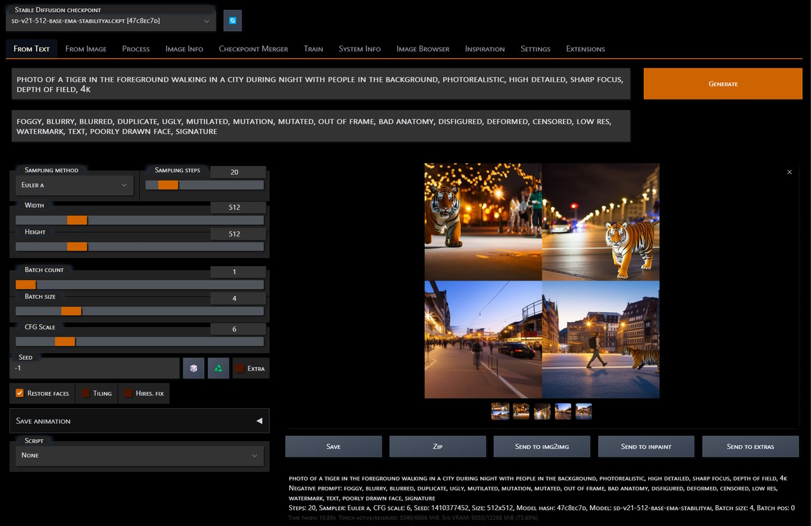

# Stable Diffusion - Automatic

*Heavily opinionated custom fork of* <https://github.com/AUTOMATIC1111/stable-diffusion-webui>  

 

## Notes

Fork is as close as up-to-date with origin as time allows  
All code changes are merged upstream whenever possible  

Fork adds extra functionality:
- New skin and UI layout  
- Ships with additional **extensions**  
  e.g. `System Info`, `Steps Animation`, etc.  
- Ships with set of **CLI** tools that rely on *SD API* for execution:  
  e.g. `generate`, `train`, `bench`, etc.  
  [Full list](<cli/>)

Simplified start script: `automatic.sh`  
*Existing `webui.sh`/`webui.bat` scripts still exist for backward compatibility*  

> ./automatic.sh  

Start in default mode with optimizations enabled  

    SD server: optimized
    Version: 56f779a9 Sat Feb 25 14:04:19 2023 -0500
    Repository: https://github.com/vladmandic/automatic
    Last Merge: Sun Feb 19 10:11:25 2023 -0500 Merge pull request #37 from AUTOMATIC1111/master
    System
    - Platform: Ubuntu 22.04.1 LTS 5.15.90.1-microsoft-standard-WSL2 x86_64
    - nVIDIA: NVIDIA GeForce RTX 3060, 528.49
    - Python: 3.10.6 Torch: 2.0.0.dev20230224+cu118 CUDA: 11.8 cuDNN: 8700 GPU: NVIDIA GeForce RTX 3060 Arch: (8, 6)
    Launching Web UI

> ./automatic.sh public  

Start with listen on public IP with authentication enabled

> ./automatic.sh clean  

Start with all optimizations disabled  
Use this for troubleshooting  

> ./automatic.sh install

Installs and updates to latest supported version:
- Dependencies
- Fixed sub-repositories
- Extensions
- Sub-modules

   

## Install

1. Install `PyTorch` first
2. Clone and initialize repository

> git clone https://github.com/vladmandic/automatic  
> cd automatic  
> ./automatic.sh install  

      SD server: install
      Version: 56f779a9 Sat Feb 25 14:04:19 2023 -0500
      Repository: https://github.com/vladmandic/automatic
      Last Merge: Sun Feb 19 10:11:25 2023 -0500 Merge pull request #37 from AUTOMATIC1111/master
      Installing general requirements
      Installing versioned requirements
      Installing requirements for Web UI
      Updating submodules
      Updating extensions
      Updating wiki
      Detached repos
      Local changes
 

 

## Differences

Fork does differ in few things:
- Drops compatibility with `python` **3.7** and requires **3.9**  
- Updated **Python** libraries to latest known compatible versions  
  e.g. `accelerate`, `transformers`, `numpy`, etc.  
- Includes opinionated **System** and **Options** configuration  
  e.g. `samplers`, `upscalers`, etc.  
- Includes reskinned **UI**  
  Black and orange dark theme with fixed width options panels and larger previews  
- Includes **SD2** configuration files  
- Uses simplified folder structure  
  e.g. `/train`, `/outputs/*`  
- Modified training templates  
- Built-in `LoRA`, `Custom Diffusion`, `Dreambooth` training  

Only Python library which is not auto-updated is `PyTorch` itself as that is very system specific  
For some Torch optimizations notes, see Wiki

Fork is compatible with regular **PyTorch 1.13** as well as pre-release of **PyTorch 2.0**  
See [Wiki](https://github.com/vladmandic/automatic/wiki) for **Torch** optimization notes

 

## Scripts

This repository comes with a large collection of scripts that can be used to process inputs, train, generate, and benchmark models  

As well as number of auxiliary scripts that do not rely on **WebUI**, but can be used for end-to-end solutions such as extract frames from videos, etc.  

For full details see [Docs](cli/README.md)

 

## Docs

- Scripts are in [Scripts](cli/README.md)  
- Everything else is in [Wiki](https://github.com/vladmandic/automatic/wiki)  
- Except my current [TODO](TODO.md)  
