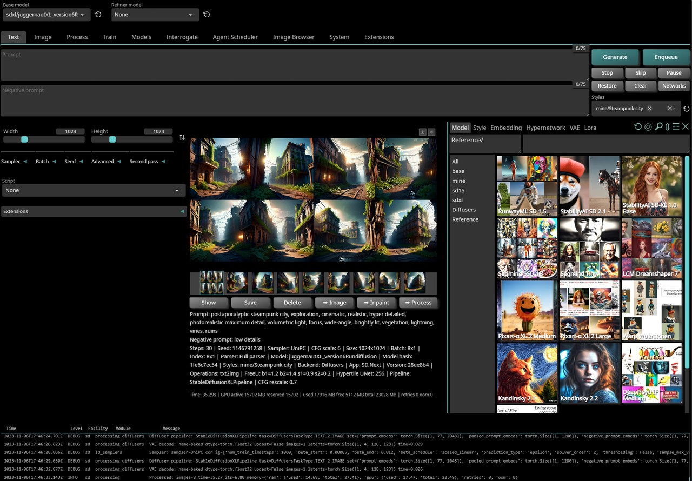

  
# SD.Next

**Stable Diffusion implementation with advanced features**

   

### [Wiki](https://github.com/vladmandic/automatic/wiki) | [Discord](https://discord.gg/VjvR2tabEX) | [Changelog](CHANGELOG.md)

## Top-13 Features (10 wasn't enough)

All Individual features are not listed here, instead check [ChangeLog](CHANGELOG.md) for full list of changes.

- Optimized processing with latest **torch** developments  
  Including built-in support for `torch.compile`
- Support for multiple backends!  
  **original** and **diffusers**
- Support for multiple diffusion models!  
  Stable Diffusion, SD-XL, Kandinsky, DeepFloyd IF, UniDiffusion, SD-Distilled, etc.  
- Fully multiplatform with platform specific autodetection and tuning performed on install  
  Windows / Linux / MacOS with CPU / nVidia / AMD / Intel / DirectML / OpenVINO  
- Improved prompt parser  
- Enhanced *Lora*/*Locon*/*Lyco* code supporting latest trends in training  
- Built-in queue management  
- Advanced metadata caching and handling to speed up operations  
- Enterprise level logging and hardened API  
- Modern localization and hints engine  
- Broad compatibility with existing extensions ecosystem and new extensions manager  
- Built in installer with automatic updates and dependency management  
- Modernized UI (still based on Gradio) with theme support  

## Backend support

**SD.Next** supports two main backends: *Original* and *Diffusers* which can be switched on-the-fly:

- **Original**: Based on [LDM](https://github.com/Stability-AI/stablediffusion) reference implementation and significantly expanded on by [A1111](https://github.com/AUTOMATIC1111/stable-diffusion-webui)  
  This is the default backend and it is fully compatible with all existing functionality and extensions  
  It supports **SD 1.x** and **SD 2.x** models  
- **Diffusers**: Based on new [Huggingface Diffusers](https://huggingface.co/docs/diffusers/index) implementation  
  It supports All models listed below  
  It is also the *only backend* that supports **Stable Diffusion XL** model  
  See [wiki article](https://github.com/vladmandic/automatic/wiki/Diffusers) for more information  

## Model support

Additional models will be added as they become available and there is public interest in them

- [Stable Diffusion](https://github.com/Stability-AI/stablediffusion/) 1.x and 2.x *(all variants)*
- [Stable Diffusion XL](https://github.com/Stability-AI/generative-models)
- [Kandinsky](https://github.com/ai-forever/Kandinsky-2) 2.1 and 2.2
- [DeepFloyd IF](https://github.com/deep-floyd/IF)
- [UniDiffusion](https://github.com/thu-ml/unidiffuser)
- [SD-Distilled](https://huggingface.co/blog/sd_distillation) *(all variants)*
- [Wuerstchen](https://huggingface.co/blog/wuertschen)  

## Platform support

- *nVidia* GPUs using **CUDA** libraries on both *Windows and Linux*
- *AMD* GPUs using **ROCm** libraries on *Linux*.  
  Support will be extended to *Windows* once AMD releases ROCm for Windows
- *Intel Arc* GPUs using **OneAPI** with *IPEX XPU* libraries on both *Windows and Linux*
- Any GPU compatible with *DirectX* on *Windows* using **DirectML** libraries.  
  This includes support for AMD GPUs that are not supported by native ROCm libraries
- Any GPU or device compatible with **OpenVINO** libraries on both *Windows and Linux*
- *Apple M1/M2* on *OSX* using built-in support in Torch with **MPS** optimizations

## Install & Run

- [Step-by-step install guide](https://github.com/vladmandic/automatic/wiki/Installation)
- [Advanced install notes](https://github.com/vladmandic/automatic/wiki/Advanced-Install)

### Installation Notes

- [Common installation errors](https://github.com/vladmandic/automatic/discussions/1627)  
- [FAQ](https://github.com/vladmandic/automatic/discussions/1011)
- Server can run without virtual environment,  
  but it is recommended to use it to avoid library version conflicts with other applications  
- **nVidia/CUDA** / **AMD/ROCm** / **Intel/OneAPI** are auto-detected if present and available,  
   but for any other use case specify required parameter explicitly or wrong packages may be installed  
  as installer will assume CPU-only environment  
- Full startup sequence is logged in `sdnext.log`, so if you encounter any issues, please check it first  

### Run

Once SD.Next is installed, simply run `webui.ps1` or `webui.bat` (*Windows*) or `webui.sh` (*Linux or MacOS*)

Below is partial list of all available parameters, run `webui --help` for the full list:

    Setup options:
      --use-directml                   Use DirectML if no compatible GPU is detected, default: False
      --use-openvino                   Use Intel OpenVINO backend, default: False
      --use-ipex                       Force use Intel OneAPI XPU backend, default: False
      --use-cuda                       Force use nVidia CUDA backend, default: False
      --use-rocm                       Force use AMD ROCm backend, default: False
      --skip-update                    Skip update of extensions and submodules, default: False
      --skip-requirements              Skips checking and installing requirements, default: False
      --skip-extensions                Skips running individual extension installers, default: False
      --skip-git                       Skips running all GIT operations, default: False
      --skip-torch                     Skips running Torch checks, default: False
      --reinstall                      Force reinstallation of all requirements, default: False
      --debug                          Run installer with debug logging, default: False
      --reset                          Reset main repository to latest version, default: False
      --upgrade                        Upgrade main repository to latest version, default: False
      --safe                           Run in safe mode with no user extensions

  

## Notes

### **Extensions**

SD.Next comes with several extensions pre-installed:

- [ControlNet](https://github.com/Mikubill/sd-webui-controlnet)
- [Agent Scheduler](https://github.com/ArtVentureX/sd-webui-agent-scheduler)
- [Multi-Diffusion Tiled Diffusion and VAE](https://github.com/pkuliyi2015/multidiffusion-upscaler-for-automatic1111)
- [LyCORIS](https://github.com/KohakuBlueleaf/a1111-sd-webui-lycoris)
- [Image Browser](https://github.com/AlUlkesh/stable-diffusion-webui-images-browser)
- [CLiP Interrogator](https://github.com/pharmapsychotic/clip-interrogator-ext)
- [Rembg Background Removal](https://github.com/AUTOMATIC1111/stable-diffusion-webui-rembg)

### **Collab**

- To avoid having this repo rely just on me, I'd love to have additional maintainers with full admin rights. If you're interested, ping me!  
- In addition to general cross-platform code, desire is to have a lead for each of the main platforms.
This should be fully cross-platform, but I would really love to have additional contributors and/or maintainers to join and help lead the efforts on different platforms.

### **Goals**

This project started as a fork from [Automatic1111 WebUI](https://github.com/AUTOMATIC1111/stable-diffusion-webui/) and it grew significantly since then,  
but although it diverged considerably, any substantial features to original work is ported to this repository as well.

The idea behind the fork is to enable latest technologies and advances in text-to-image generation.

> *Sometimes this is not the same as "as simple as possible to use".*

If you are looking an amazing simple-to-use Stable Diffusion tool, I'd suggest [InvokeAI](https://invoke-ai.github.io/InvokeAI/) specifically due to its automated installer and ease of use.  

General goals:

- Cross-platform
  - Create uniform experience while automatically managing any platform specific differences
- Performance
  - Enable best possible performance on all platforms
- Ease-of-Use
  - Automatically handle all requirements, dependencies, flags regardless of platform
  - Integrate all best options for uniform out-of-the-box experience without the need to tweak anything manually
- Look-and-Feel
  - Create modern, intuitive and clean UI
- Up-to-Date
  - Keep code up to date with latest advanced in text-to-image generation

## Credits

- Main credit goes to [Automatic1111 WebUI](https://github.com/AUTOMATIC1111/stable-diffusion-webui)
- Additional credits are listed in [Credits](https://github.com/AUTOMATIC1111/stable-diffusion-webui/#credits)
- Licenses for modules are listed in [Licenses](html/licenses.html)

### **Docs**

- [Wiki](https://github.com/vladmandic/automatic/wiki)
- [ReadMe](README.md)
- [ToDo](TODO.md)  
- [ChangeLog](CHANGELOG.md)
- [CLI Tools](cli/README.md)

### **Sponsors**

<!-- sponsors --><!-- sponsors -->

 
