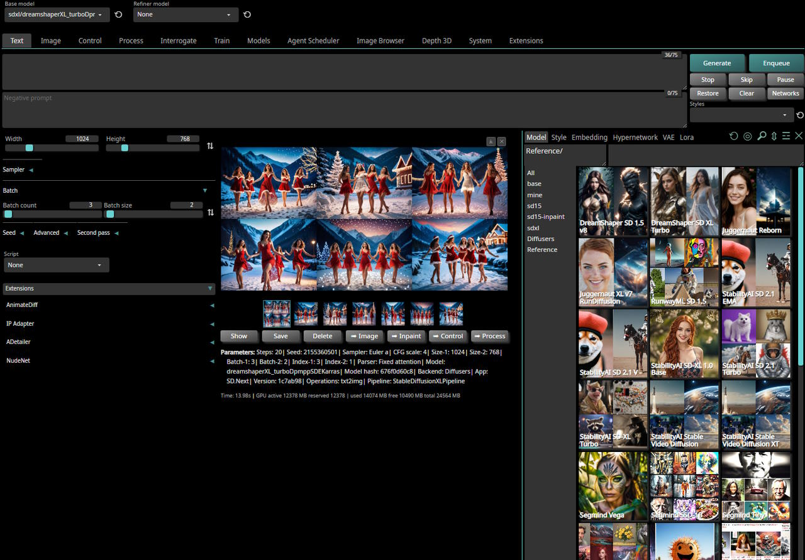
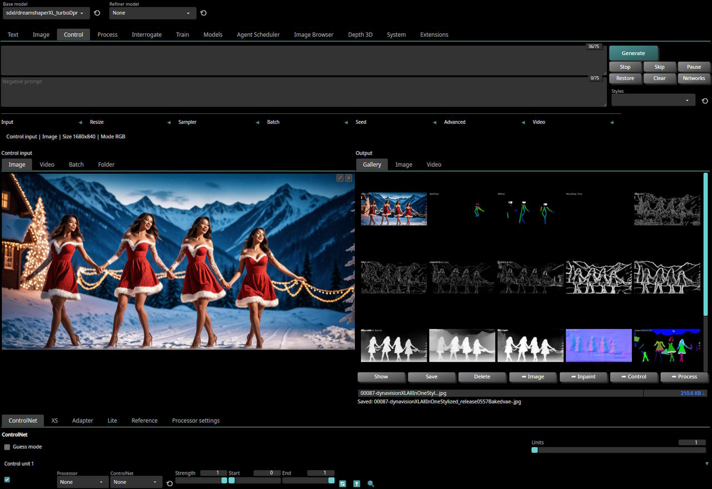
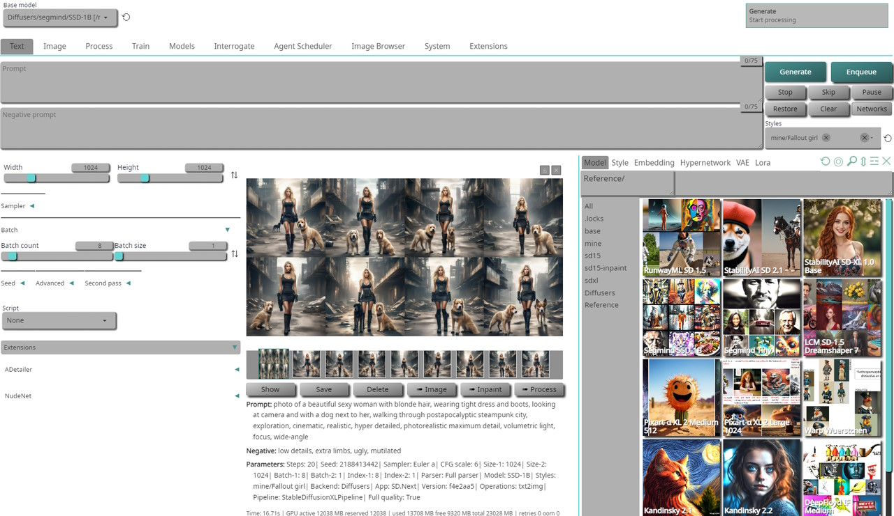

# SD.Next

**Stable Diffusion implementation with advanced features**

[Wiki](https://github.com/vladmandic/automatic/wiki) | [Discord](https://discord.gg/VjvR2tabEX) | [Changelog](CHANGELOG.md)

 

## Notable features

All individual features are not listed here, instead check [ChangeLog](CHANGELOG.md) for full list of changes
- Multiple backends!  
  ▹ **Original | Diffusers**
- Multiple diffusion models!  
  ▹ **Stable Diffusion 1.5/2.1 | SD-XL | LCM | Segmind | Kandinsky | Pixart-α | Würstchen | aMUSEd | DeepFloyd IF | UniDiffusion | SD-Distilled | BLiP Diffusion | etc.**
- Built-in Control for Text, Image, Batch and video processing!  
  ▹ **ControlNet | ControlNet XS | Control LLLite | T2I Adapters | IP Adapters**  
- Multiplatform!  
 ▹ **Windows | Linux | MacOS with CPU | nVidia | AMD | IntelArc | DirectML | OpenVINO | ONNX+Olive**
- Platform specific autodetection and tuning performed on install
- Optimized processing with latest `torch` developments with built-in support for `torch.compile` and multiple compile backends
- Improved prompt parser  
- Enhanced *Lora*/*LoCon*/*Lyco* code supporting latest trends in training  
- Built-in queue management  
- Enterprise level logging and hardened API  
- Modern localization and hints engine  
- Broad compatibility with existing extensions ecosystem and new extensions manager  
- Built in installer with automatic updates and dependency management  
- Modernized UI with theme support and number of built-in themes *(dark and light)*  

 

 

## Backend support

**SD.Next** supports two main backends: *Original* and *Diffusers*:

- **Original**: Based on [LDM](https://github.com/Stability-AI/stablediffusion) reference implementation and significantly expanded on by [A1111](https://github.com/AUTOMATIC1111/stable-diffusion-webui)  
  This is the default backend and it is fully compatible with all existing functionality and extensions  
  Supports **SD 1.x** and **SD 2.x** models  
  All other model types such as *SD-XL, LCM, PixArt, Segmind, Kandinsky, etc.* require backend **Diffusers**  
- **Diffusers**: Based on new [Huggingface Diffusers](https://huggingface.co/docs/diffusers/index) implementation  
  Supports *original* SD models as well as *all* models listed below  
  See [wiki article](https://github.com/vladmandic/automatic/wiki/Diffusers) for more information  

## Model support

Additional models will be added as they become available and there is public interest in them

- [RunwayML Stable Diffusion](https://github.com/Stability-AI/stablediffusion/) 1.x and 2.x *(all variants)*  
- [StabilityAI Stable Diffusion XL](https://github.com/Stability-AI/generative-models)  
- [StabilityAI Stable Video Diffusion](https://huggingface.co/stabilityai/stable-video-diffusion-img2vid) Base and XT  
- [LCM: Latent Consistency Models](https://github.com/openai/consistency_models)  
- [aMUSEd 256](https://huggingface.co/amused/amused-256) 256 and 512
- [Segmind Vega](https://huggingface.co/segmind/Segmind-Vega)  
- [Segmind SSD-1B](https://huggingface.co/segmind/SSD-1B)  
- [Kandinsky](https://github.com/ai-forever/Kandinsky-2) *2.1 and 2.2 and latest 3.0*  
- [PixArt-α XL 2](https://github.com/PixArt-alpha/PixArt-alpha) *Medium and Large*  
- [Warp Wuerstchen](https://huggingface.co/blog/wuertschen)  
- [Playground](https://huggingface.co/playgroundai/playground-v2-256px-base) *v1, v2 256, v2 512, v2 1024*  
- [Tsinghua UniDiffusion](https://github.com/thu-ml/unidiffuser)
- [DeepFloyd IF](https://github.com/deep-floyd/IF) *Medium and Large*
- [ModelScope T2V](https://huggingface.co/damo-vilab/text-to-video-ms-1.7b)
- [Segmind SD Distilled](https://huggingface.co/blog/sd_distillation) *(all variants)*
- [BLIP-Diffusion](https://dxli94.github.io/BLIP-Diffusion-website/)  

Also supported are modifiers such as:
- **LCM** and **Turbo** (Adversarial Diffusion Distillation) networks
- All **LoRA** types such as LoCon, LyCORIS, HADA, IA3, Lokr, OFT
- **AnimateDiff** for SD 1.5
- **IP-Adapters** for SD 1.5 and SD-XL

> [!IMPORTANT]
> - Loading any model other than standard SD 1.x / SD 2.x requires use of backend **Diffusers**  
> - Loading any other models using **Original** backend is not supported  
> - Loading manually download model `.safetensors` files is supported for SD 1.x / SD 2.x / SD-XL models only  
> - For all other model types, use backend **Diffusers** and use built in Model downloader or  
  select model from Networks -> Models -> Reference list in which case it will be auto-downloaded and loaded  

## Platform support

- *nVidia* GPUs using **CUDA** libraries on both *Windows and Linux*  
- *AMD* GPUs using **ROCm** libraries on *Linux*  
  Support will be extended to *Windows* once AMD releases ROCm for Windows  
- *Intel Arc* GPUs using **OneAPI** with *IPEX XPU* libraries on both *Windows and Linux*  
- Any GPU compatible with *DirectX* on *Windows* using **DirectML** libraries  
  This includes support for AMD GPUs that are not supported by native ROCm libraries  
- Any GPU or device compatible with **OpenVINO** libraries on both *Windows and Linux*  
- *Apple M1/M2* on *OSX* using built-in support in Torch with **MPS** optimizations  
- *ONNX/Olive* (experimental)  

## Install

- [Step-by-step install guide](https://github.com/vladmandic/automatic/wiki/Installation)
- [Advanced install notes](https://github.com/vladmandic/automatic/wiki/Advanced-Install)
- [Common installation errors](https://github.com/vladmandic/automatic/discussions/1627)  
- [FAQ](https://github.com/vladmandic/automatic/discussions/1011)
- If you can't run us locally, try our friends at [RunDuffusion!](https://rundiffusion.com?utm_source=github&utm_medium=referral&utm_campaign=SDNext)

> [!TIP]
> - Server can run without virtual environment,  
  Recommended to use `VENV` to avoid library version conflicts with other applications  
> - **nVidia/CUDA** / **AMD/ROCm** / **Intel/OneAPI** are auto-detected if present and available,  
  For any other use case such as **DirectML**, **ONNX/Olive**, **OpenVINO** specify required parameter explicitly  
  or wrong packages may be installed as installer will assume CPU-only environment  
> - Full startup sequence is logged in `sdnext.log`,  
  so if you encounter any issues, please check it first  

### Run

Once SD.Next is installed, simply run `webui.ps1` or `webui.bat` (*Windows*) or `webui.sh` (*Linux or MacOS*)

Below is partial list of all available parameters, run `webui --help` for the full list:

    Server options:
      --config CONFIG                  Use specific server configuration file, default: config.json
      --ui-config UI_CONFIG            Use specific UI configuration file, default: ui-config.json
      --medvram                        Split model stages and keep only active part in VRAM, default: False
      --lowvram                        Split model components and keep only active part in VRAM, default: False
      --ckpt CKPT                      Path to model checkpoint to load immediately, default: None
      --vae VAE                        Path to VAE checkpoint to load immediately, default: None
      --data-dir DATA_DIR              Base path where all user data is stored, default:
      --models-dir MODELS_DIR          Base path where all models are stored, default: models
      --share                          Enable UI accessible through Gradio site, default: False
      --insecure                       Enable extensions tab regardless of other options, default: False
      --listen                         Launch web server using public IP address, default: False
      --auth AUTH                      Set access authentication like "user:pwd,user:pwd""
      --autolaunch                     Open the UI URL in the system's default browser upon launch
      --docs                           Mount Gradio docs at /docs, default: False
      --no-hashing                     Disable hashing of checkpoints, default: False
      --no-metadata                    Disable reading of metadata from models, default: False
      --backend {original,diffusers}   force model pipeline type

    Setup options:
      --debug                          Run installer with debug logging, default: False
      --reset                          Reset main repository to latest version, default: False
      --upgrade                        Upgrade main repository to latest version, default: False
      --requirements                   Force re-check of requirements, default: False
      --quick                          Run with startup sequence only, default: False
      --use-directml                   Use DirectML if no compatible GPU is detected, default: False
      --use-openvino                   Use Intel OpenVINO backend, default: False
      --use-ipex                       Force use Intel OneAPI XPU backend, default: False
      --use-cuda                       Force use nVidia CUDA backend, default: False
      --use-rocm                       Force use AMD ROCm backend, default: False
      --use-xformers                   Force use xFormers cross-optimization, default: False
      --skip-requirements              Skips checking and installing requirements, default: False
      --skip-extensions                Skips running individual extension installers, default: False
      --skip-git                       Skips running all GIT operations, default: False
      --skip-torch                     Skips running Torch checks, default: False
      --skip-all                       Skips running all checks, default: False
      --experimental                   Allow unsupported versions of libraries, default: False
      --reinstall                      Force reinstallation of all requirements, default: False
      --safe                           Run in safe mode with no user extensions

## Notes

### **Extensions**

SD.Next comes with several extensions pre-installed:

- [ControlNet](https://github.com/Mikubill/sd-webui-controlnet)
- [Agent Scheduler](https://github.com/ArtVentureX/sd-webui-agent-scheduler)
- [Image Browser](https://github.com/AlUlkesh/stable-diffusion-webui-images-browser)

### **Collab**

- We'd love to have additional maintainers with full admin rights. If you're interested, ping us!  
- In addition to general cross-platform code, desire is to have a lead for each of the main platforms.
This should be fully cross-platform, but we'd really love to have additional contributors and/or maintainers to join and help lead the efforts on different platforms.

## Credits

- Main credit goes to [Automatic1111 WebUI](https://github.com/AUTOMATIC1111/stable-diffusion-webui)
- Additional credits are listed in [Credits](https://github.com/AUTOMATIC1111/stable-diffusion-webui/#credits)
- Licenses for modules are listed in [Licenses](html/licenses.html)

### **Docs**

If you're unsure how to use a feature, best place to start is [Wiki](https://github.com/vladmandic/automatic/wiki) and if its not there,  
check [ChangeLog](CHANGELOG.md) for when feature was first introduced as it will always have a short note on how to use it  

- [Wiki](https://github.com/vladmandic/automatic/wiki)
- [ReadMe](README.md)
- [ToDo](TODO.md)  
- [ChangeLog](CHANGELOG.md)
- [CLI Tools](cli/README.md)

### **Sponsors**

<!-- sponsors --><!-- sponsors -->

 
