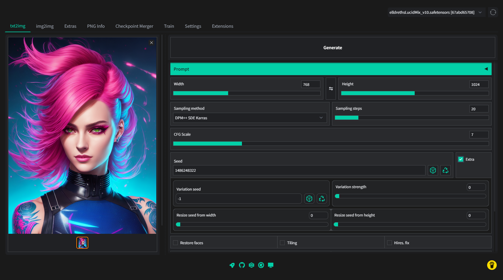

# Stable Diffusion web UI
A browser interface based on Gradio library for Stable Diffusion.



## Feature showcase

[Detailed feature showcase with images, art by Greg Rutkowski](https://github.com/AUTOMATIC1111/stable-diffusion-webui-feature-showcase)

- Original txt2img and img2img modes
- One click install and run script (but you still must install python and git)
- Outpainting
- Inpainting
- Prompt matrix
- Stable Diffusion upscale
- Attention
- Loopback
- X/Y plot
- Textual Inversion
- Extras tab with:
  - GFPGAN, neural network that fixes faces
  - CodeFormer, face restoration tool as an alternative to GFPGAN
  - RealESRGAN, neural network upscaler
  - ESRGAN, neural network with a lot of third party models
- Resizing aspect ratio options
- Sampling method selection
- Interrupt processing at any time
- 4GB video card support
- Correct seeds for batches
- Prompt length validation
- Generation parameters added as text to PNG
- Tab to view an existing picture's generation parameters
- Settings page
- Running custom code from UI
- Mouseover hints for most UI elements
- Possible to change defaults/mix/max/step values for UI elements via text config
- Random artist button
- Tiling support: UI checkbox to create images that can be tiled like textures
- Progress bar and live image generation preview
- Negative prompt
- Styles
- Variations
- Seed resizing
- CLIP interrogator

## Installing and running

You need [python](https://www.python.org/downloads/windows/) and [git](https://git-scm.com/download/win)
installed to run this, and an NVidia video card.

You need `model.ckpt`, Stable Diffusion model checkpoint, a big file containing the neural network weights. You
can obtain it from the following places:
 - [official download](https://huggingface.co/CompVis/stable-diffusion-v-1-4-original)
 - [file storage](https://drive.yerf.org/wl/?id=EBfTrmcCCUAGaQBXVIj5lJmEhjoP1tgl)
 - magnet:?xt=urn:btih:3a4a612d75ed088ea542acac52f9f45987488d1c&dn=sd-v1-4.ckpt&tr=udp%3a%2f%2ftracker.openbittorrent.com%3a6969%2fannounce&tr=udp%3a%2f%2ftracker.opentrackr.org%3a1337

You can optionally use GFPGAN to improve faces, to do so you'll need to download the model from [here](https://github.com/TencentARC/GFPGAN/releases/download/v1.3.0/GFPGANv1.3.pth) and place it in the same directory as `webui.bat`.

To use ESRGAN models, put them into ESRGAN directory in the same location as webui.py. A file will be loaded
as a model if it has .pth extension, and it will show up with its name in the UI. Grab models from the [Model Database](https://upscale.wiki/wiki/Model_Database).

> Note: RealESRGAN models are not ESRGAN models, they are not compatible. Do not download RealESRGAN models. Do not place
RealESRGAN into the directory with ESRGAN models. Thank you.

### Automatic installation/launch

- install [Python 3.10.6](https://www.python.org/downloads/windows/) and check "Add Python to PATH" during installation. You must install this exact version.
- install [git](https://git-scm.com/download/win)
- place `model.ckpt` into webui directory, next to `webui.bat`.
- _*(optional)*_ place `GFPGANv1.3.pth` into webui directory, next to `webui.bat`.
- run `webui-user.bat` from Windows Explorer. Run it as a normal user, ***not*** as administrator.

#### Troubleshooting

- if your version of Python is not in PATH (or if another version is), edit `webui-user.bat`, and modify the
line `set PYTHON=python` to say the full path to your python executable, for example: `set PYTHON=B:\soft\Python310\python.exe`.
You can do this for python, but not for git.
- if you get out of memory errors and your video-card has a low amount of VRAM (4GB), use custom parameter `set COMMANDLINE_ARGS` (see section below)
to enable appropriate optimization according to low VRAM guide below (for example, `set COMMANDLINE_ARGS=--medvram --opt-split-attention`).
- to prevent the creation of virtual environment and use your system python, use custom parameter replacing `set VENV_DIR=-` (see below).
- webui.bat installs requirements from files `requirements_versions.txt`, which lists versions for modules specifically compatible with
Python 3.10.6. If you choose to install for a different version of python,  using custom parameter `set REQS_FILE=requirements.txt`
may help (but I still recommend you to just use the recommended version of python).
- if you feel you broke something and want to reinstall from scratch, delete directories: `venv`, `repositories`.
- if you get a green or black screen instead of generated pictures, you have a card that doesn't support half precision
floating point numbers (Known issue with 16xx cards). You must use `--precision full --no-half` in addition to command line
arguments (set them using `set COMMANDLINE_ARGS`, see below), and the model will take much more space in VRAM (you will likely
have to also use at least `--medvram`).
- the installer creates a python virtual environment, so none of the installed modules will affect your system installation of python if
you had one prior to installing this.
- About _"You must install this exact version"_ from the instructions above: you can use any version of python you like,
and it will likely work, but if you want to seek help about things not working, I will not offer help unless you use this
exact version for my sanity.

#### How to run with custom parameters

It's possible to edit `set COMMANDLINE_ARGS=` line in `webui.bat` to run the program with different command line arguments, but that may lead
to inconveniences when the file is updated in the repository.

The recommended way is to use another .bat file named anything you like, set the parameters you want in it, and run webui.bat from it.
A `webui-user.bat` file included into the repository does exactly this.

Here is an example that runs the program with `--opt-split-attention` argument:

```commandline
@echo off

set COMMANDLINE_ARGS=--opt-split-attention

call webui.bat
```

Another example, this file will run the program with a custom python path, a different model named `a.ckpt` and without a virtual environment:

```commandline
@echo off

set PYTHON=b:/soft/Python310/Python.exe
set VENV_DIR=-
set COMMANDLINE_ARGS=--ckpt a.ckpt

call webui.bat
```

### How to create large images?
Use `--opt-split-attention` parameter. It slows down sampling a tiny bit, but allows you to make gigantic images.

### What options to use for low VRAM video-cards?
You can, through command line arguments, enable the various optimizations which sacrifice some/a lot of speed in favor of
using less VRAM. Those arguments are added to the `COMMANDLINE_ARGS` parameter, see section above.

Here's a list of optimization arguments:
- If you have 4GB VRAM and want to make 512x512 (or maybe up to 640x640) images, use `--medvram`.
- If you have 4GB VRAM and want to make 512x512 images, but you get an out of memory error with `--medvram`, use `--medvram --opt-split-attention` instead.
- If you have 4GB VRAM and want to make 512x512 images, and you still get an out of memory error, use `--lowvram --always-batch-cond-uncond --opt-split-attention` instead.
- If you have 4GB VRAM and want to make images larger than you can with `--medvram`, use  `--lowvram --opt-split-attention`.
- If you have more VRAM and want to make larger images than you can usually make (for example 1024x1024 instead of 512x512), use `--medvram --opt-split-attention`. You can use `--lowvram`
also but the effect will likely be barely noticeable.
- Otherwise, do not use any of those.

### Running online

Use the `--share` option to run online. You will get a xxx.app.gradio link. This is the intended way to use the
program in collabs. You may set up authentication for said gradio shared instance with the flag `--gradio-auth username:password`, optionally providing multiple sets of usernames and passwords separated by commas.

Use `--listen` to make the server listen to network connections. This will allow computers on the local network
to access the UI, and if you configure port forwarding, also computers on the internet.

Use `--port xxxx` to make the server listen on a specific port, xxxx being the wanted port. Remember that
all ports below 1024 need root/admin rights, for this reason it is advised to use a port above 1024.
Defaults to port 7860 if available.

### Google collab

If you don't want or can't run locally, here is a Google colab that allows you to run the webui:

https://colab.research.google.com/drive/1Iy-xW9t1-OQWhb0hNxueGij8phCyluOh

### Textual Inversion
To make use of pretrained embeddings, create an `embeddings` directory (in the same place as `webui.py`)
and put your embeddings into it. They must be either .pt or .bin files, each with only one trained embedding,
and the filename (without .pt/.bin) will be the term you'll use in the prompt to get that embedding.

As an example, I trained one for about 5000 steps: https://files.catbox.moe/e2ui6r.pt; it does not produce
very good results, but it does work. To try it out download the file, rename it to `Usada Pekora.pt`, put it into the `embeddings` dir
and use `Usada Pekora` in the prompt.

You may also try some from the growing library of embeddings at https://huggingface.co/sd-concepts-library, downloading one of the `learned_embeds.bin` files, renaming it to the term you want to use for it in the prompt (be sure to keep the .bin extension) and putting it in your `embeddings` directory.

### How to change UI defaults?

After running once, a `ui-config.json` file appears in webui directory:

```json
{
    "txt2img/Sampling Steps/value": 20,
    "txt2img/Sampling Steps/minimum": 1,
    "txt2img/Sampling Steps/maximum": 150,
    "txt2img/Sampling Steps/step": 1,
    "txt2img/Batch count/value": 1,
    "txt2img/Batch count/minimum": 1,
    "txt2img/Batch count/maximum": 32,
    "txt2img/Batch count/step": 1,
    "txt2img/Batch size/value": 1,
    "txt2img/Batch size/minimum": 1,
```

Edit values to your liking and the next time you launch the program they will be applied.

### Almost automatic installation and launch

Install python and git, place `model.ckpt` and `GFPGANv1.3.pth` into webui directory, run:

```
python launch.py
```

This installs packages via pip. If you need to use a virtual environment, you must set it up yourself. I will not
provide support for using the web ui this way unless you are using the recommended version of python below.

If you'd like to use command line parameters, use them right there:

```
python launch.py --opt-split-attention --ckpt ../secret/anime9999.ckpt
```

### Manual installation
Alternatively, if you don't want to run the installer, here are instructions for installing
everything by hand. This can run on both Windows and Linux (if you're on linux, use `ls`
instead of `dir`). 

```bash
# install torch with CUDA support. See https://pytorch.org/get-started/locally/ for more instructions if this fails.
pip install torch --extra-index-url https://download.pytorch.org/whl/cu113

# check if torch supports GPU; this must output "True". You need CUDA 11. installed for this. You might be able to use
# a different version, but this is what I tested.
python -c "import torch; print(torch.cuda.is_available())"

# clone web ui and go into its directory
git clone https://github.com/AUTOMATIC1111/stable-diffusion-webui.git
cd stable-diffusion-webui

# clone repositories for Stable Diffusion and (optionally) CodeFormer
mkdir repositories
git clone https://github.com/CompVis/stable-diffusion.git repositories/stable-diffusion
git clone https://github.com/CompVis/taming-transformers.git repositories/taming-transformers
git clone https://github.com/sczhou/CodeFormer.git repositories/CodeFormer
git clone https://github.com/salesforce/BLIP.git repositories/BLIP

# install requirements of Stable Diffusion
pip install transformers==4.19.2 diffusers invisible-watermark --prefer-binary

# install k-diffusion
pip install git+https://github.com/crowsonkb/k-diffusion.git --prefer-binary

# (optional) install GFPGAN (face restoration)
pip install git+https://github.com/TencentARC/GFPGAN.git --prefer-binary

# (optional) install requirements for CodeFormer (face restoration)
pip install -r repositories/CodeFormer/requirements.txt --prefer-binary

# install requirements of web ui
pip install -r requirements.txt  --prefer-binary

# update numpy to latest version
pip install -U numpy  --prefer-binary

# (outside of command line) put stable diffusion model into web ui directory
# the command below must output something like: 1 File(s) 4,265,380,512 bytes
dir model.ckpt

# (outside of command line) put the GFPGAN model into web ui directory
# the command below must output something like: 1 File(s) 348,632,874 bytes
dir GFPGANv1.3.pth
```

> Note: the directory structure for manual instruction has been changed on 2022-09-09 to match automatic installation: previously
> webui was in a subdirectory of stable diffusion, now it's the reverse. If you followed manual installation before the
> change, you can still use the program with your existing directory structure.

After that the installation is finished.

Run the command to start web ui:

```
python webui.py
```

If you have a 4GB video card, run the command with either `--lowvram` or `--medvram` argument:

```
python webui.py --medvram
```

After a while, you will get a message like this:

```
Running on local URL:  http://127.0.0.1:7860/
```

Open the URL in a browser, and you are good to go.


### Windows 11 WSL2 instructions
Alternatively, here are instructions for installing under Windows 11 WSL2 Linux distro, everything by hand:

```bash
# install conda (if not already done)
wget https://repo.anaconda.com/archive/Anaconda3-2022.05-Linux-x86_64.sh
chmod +x Anaconda3-2022.05-Linux-x86_64.sh 
./Anaconda3-2022.05-Linux-x86_64.sh

# Clone webui repo
git clone https://github.com/AUTOMATIC1111/stable-diffusion-webui.git
cd stable-diffusion-webui

# Create and activate conda env
conda env create -f environment-wsl2.yaml
conda activate automatic

# (optional) install requirements for GFPGAN (upscaling)
wget https://github.com/TencentARC/GFPGAN/releases/download/v1.3.0/GFPGANv1.3.pth
```

After that follow the instructions in the `Manual instructions` section starting at step `:: clone repositories for Stable Diffusion and (optionally) CodeFormer`.

### Custom scripts from users

[A list of custom scripts](https://github.com/AUTOMATIC1111/stable-diffusion-webui/wiki/Custom-scripts-from-users), along with installation instructions.

### img2img alternative test
- see [this post](https://www.reddit.com/r/StableDiffusion/comments/xboy90/a_better_way_of_doing_img2img_by_finding_the/) on ebaumsworld.com for context.
- find it in scripts section
- put description of input image into the Original prompt field
- use Euler only
- recommended: 50 steps, low cfg scale between 1 and 2
- denoising and seed don't matter
- decode cfg scale between 0 and 1
- decode steps 50
- original blue haired woman close nearly reproduces with cfg scale=1.8

## Credits
- Stable Diffusion - https://github.com/CompVis/stable-diffusion, https://github.com/CompVis/taming-transformers
- k-diffusion - https://github.com/crowsonkb/k-diffusion.git
- GFPGAN - https://github.com/TencentARC/GFPGAN.git
- ESRGAN - https://github.com/xinntao/ESRGAN
- Ideas for optimizations - https://github.com/basujindal/stable-diffusion
- Cross Attention layer optimization - https://github.com/Doggettx/stable-diffusion
- Idea for SD upscale - https://github.com/jquesnelle/txt2imghd
- CLIP interrogator idea and borrowing some code - https://github.com/pharmapsychotic/clip-interrogator
- Initial Gradio script - posted on 4chan by an Anonymous user. Thank you Anonymous user.
- (You)
