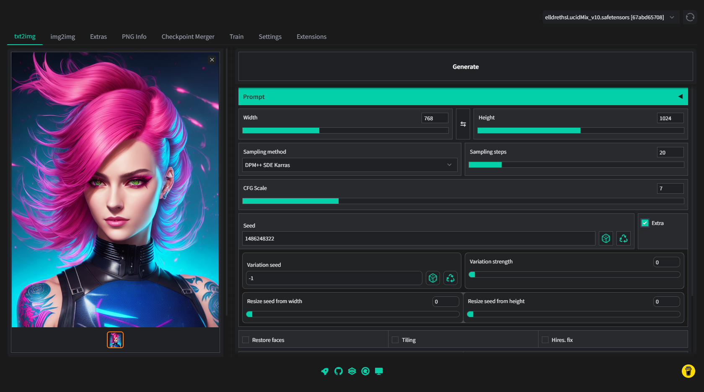

# Stable Diffusion web UI
A web interface for Stable Diffusion, implemented using Gradio library.

## Features
[Detailed feature showcase with images](https://github.com/AUTOMATIC1111/stable-diffusion-webui/wiki/Features):
- Original txt2img and img2img masterpiece, best quality, ultra-detailed, photorealistic, 20-year-old woman, full-body shot, completely nude, small perky breasts, both hands gently cupping and lifting her own breasts, bright genuine smile looking at viewer, long wavy dark-brown hair, smooth fair skin, soft diffused daylight, standing in minimalist white room, cinematic lighting, 8k resolution

Prompt negativo (igual ao anterior):

clothes, underwear, lingerie, blurry, out of focus, extra limbs, deformed hands, bad anatomy, watermark, text, logo, lowres, overexposed, underexposed

Parâmetros rápidos:
Sampler: DPM++ 2M Karras | Steps: 25 | CFG: 7 | Size: 768×1152  
