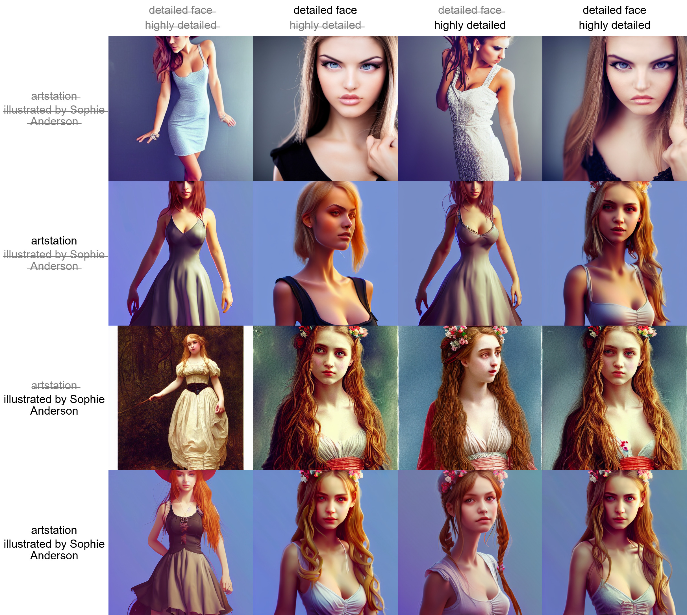

# Stable Diffusion web UI
A browser interface based on Gradio library for Stable Diffusion.

Original script with Gradio UI was written by a kind anonymous user. This is a modification.


## Installing and running

### Stable Diffusion

This script assumes that you already have main Stable Diffusion sutff installed, assumed to be in directory `/sd`.
If you don't have it installed, follow the guide:

- https://rentry.org/kretard

This repository's `webgui.py` is a replacement for `kdiff.py` from the guide.

Particularly, following files must exist:

- `/sd/configs/stable-diffusion/v1-inference.yaml`
- `/sd/models/ldm/stable-diffusion-v1/model.ckpt`
- `/sd/ldm/util.py`
- `/sd/k_diffusion/__init__.py`

### GFPGAN

If you want to use GFPGAN to improve generated faces, you need to install it separately.
Follow instructions from https://github.com/TencentARC/GFPGAN, but when cloning it, do so into Stable Diffusion main directory, `/sd`.
After that download [GFPGANv1.3.pth](https://github.com/TencentARC/GFPGAN/releases/download/v1.3.0/GFPGANv1.3.pth) and put it
into the `/sd/GFPGAN/experiments/pretrained_models` directory. If you're getting troubles with GFPGAN support, follow instructions
from the GFPGAN's repository until `inference_gfpgan.py` script works.

The following files must exist:

- `/sd/GFPGAN/inference_gfpgan.py`
- `/sd/GFPGAN/experiments/pretrained_models/GFPGANv1.3.pth`

If the GFPGAN directory does not exist, you will not get the option to use GFPGAN in the UI. If it does exist, you will either be able
to use it, or there will be a message in console with an error related to GFPGAN.

### Web UI

Run the script as:

`python webui.py`

When running the script, you must be in the main Stable Diffusion directory, `/sd`. If you cloned this repository into a subdirectory 
of `/sd`, say, the `stable-diffusion-webui` directory, you will run it as:

`python stable-diffusion-webui/webui.py`

When launching, you may get a very long warning message related to some weights not being used. You may freely ignore it.
After a while, you will get a message like this:

```
Running on local URL:  http://127.0.0.1:7860/
```

Open the URL in browser, and you are good to go.

## Features
The script creates a web UI for Stable Diffusion's txt2img and img2img scripts. Following are features added
that are not in original script.

### Extras tab
Additional neural network image improvement methods unrelated to stable diffusion.

#### GFPGAN
Lets you improve faces in pictures using the GFPGAN model. There is a checkbox in every tab to use GFPGAN at 100%, and
also a separate tab that just allows you to use GFPGAN on any picture, with a slider that controls how strongthe effect is.


#### Real-ESRGAN
Image upscaler. You can choose from multiple models by original author, and specify by how much the image should be upscaled.
Requires `realesrgan` librarty:

```commandline
pip install realesrgan
```

### Sampling method selection
Pick out of multiple sampling methods for txt2img:


### Prompt matrix
Separate multiple prompts using the `|` character, and the system will produce an image for every combination of them.
For example, if you use `a busy city street in a modern city|illustration|cinematic lighting` prompt, there are four combinations possible (first part of prompt is always kept):

- `a busy city street in a modern city`
- `a busy city street in a modern city, illustration`
- `a busy city street in a modern city, cinematic lighting`
- `a busy city street in a modern city, illustration, cinematic lighting`

Four images will be produced, in this order, all with same seed and each with corresponding prompt:


Another example, this time with 5 prompts and 16 variations:


If you use this feature, batch count will be ignored, because the number of pictures to produce
depends on your prompts, but batch size will still work (generating multiple pictures at the
same time for a small speed boost).

### Flagging
Click the Flag button under the output section, and generated images will be saved to `log/images` directory, and generation parameters
will be appended to a csv file `log/log.csv` in the `/sd` directory.

> but every image is saved, why would I need this?

If you're like me, you experiment a lot with prompts and settings, and only few images are worth saving. You can
just save them using right click in browser, but then you won't be able to reproduce them later because you will not
know what exact prompt created the image. If you use the flag button, generation paramerters will be written to csv file,
and you can easily find parameters for an image by searching for its filename.

### Copy-paste generation parameters
A text output provides generation parameters in an easy to copy-paste form for easy sharing.


If you generate multiple pictures, the displayed seed will be the seed of the first one.

### Correct seeds for batches
If you use a seed of 1000 to generate two batches of two images each, four generated images will have seeds: `1000, 1001, 1002, 1003`.
Previous versions of the UI would produce `1000, x, 1001, x`, where x is an iamge that can't be generated by any seed.

### Resizing
There are three options for resizing input images in img2img mode:

- Just resize - simply resizes source image to target resolution, resulting in incorrect aspect ratio
- Crop and resize - resize source image preserving aspect ratio so that entirety of target resolution is occupied by it, and crop parts that stick out
- Resize and fill - resize source image preserving aspect ratio so that it entirely fits target resolution, and fill empty space by rows/columns from source image

Example:


### Loading
Gradio's loading graphic has a very negative effect on the processing speed of the neural network. 
My RTX 3090 makes images about 10% faster when the tab with gradio is not active. By default, the UI
now hides loading progress animation and replaces it with static "Loading..." text, which achieves
the same effect. Use the `--no-progressbar-hiding` commandline option to revert this and show loading animations.

### Prompt validation
Stable Diffusion has a limit for input text length. If your prompt is too long, you will get a
warning in the text output field, showing which parts of your text were truncated and ignored by the model.

### Loopback
A checkbox for img2img allowing to automatically feed output image as input for the next batch. Equivalent to
saving output image, and replacing input image with it. Batch count setting controls how many iterations of
this you get.

Usually, when doing this, you would choose one of many images for the next iteration yourself, so the usefulness
of this feature may be questionable, but I've managed to get some very nice outputs with it that I wasn't abble
to get otherwise.

Example: (cherrypicked result; original picture by anon)


### Png info
Adds information about generation parameters to PNG as a text chunk. You
can view this information later using any software that supports viewing
PNG chunk info, for example: https://www.nayuki.io/page/png-file-chunk-inspector


### Textual Inversion
Allows you to use pretrained textual inversion embeddings.
See originial site for details: https://textual-inversion.github.io/.
I used lstein's repo for training embdedding: https://github.com/lstein/stable-diffusion; if
you want to train your own, I recommend following the guide on his site.

No additional libraries/repositories are required to use pretrained embeddings.

To make use of pretrained embeddings, create `embeddings` directory in the root dir of Stable
Diffusion and put your embeddings into it. They must be .pt files about 5Kb in size, each with only
one trained embedding, and the filename (without .pt) will be the term you'd use in prompt
to get that embedding.

As an example, I trained one for about 5000 steps: https://files.catbox.moe/e2ui6r.pt; it does
not produce very good results, but it does work. Download and rename it to `Usada Pekora.pt`,
and put it into `embeddings` dir and use Usada Pekora in prompt.


### Settings
A tab with settings, allowing you to use UI to edit more than half of parameters that previously
were commandline. Settings are saved to config.js file. Settings that remain as commandline
options are ones that are required at startup.
