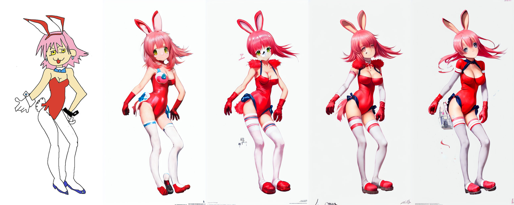

# Stable Diffusion web UI
A browser interface based on Gradio library for Stable Diffusion.

Original script with Gradio UI was written by a kind anonymous user. This is a modification.


## Installing and running

You need [python](https://www.python.org/downloads/windows/) and [git](https://git-scm.com/download/win)
installed to run this, and an NVidia videocard.

I tested the installation to work Windows with Python 3.8.10, and with Python 3.10.6. You may be able
to have success with different versions.

You need `model.ckpt`, Stable Diffusion model checkpoint, a big file containing the neural network weights. You
can obtain it from the following places:
 - [official download](https://huggingface.co/CompVis/stable-diffusion-v-1-4-original)
 - [file storage](https://drive.yerf.org/wl/?id=EBfTrmcCCUAGaQBXVIj5lJmEhjoP1tgl)
 - magnet:?xt=urn:btih:3a4a612d75ed088ea542acac52f9f45987488d1c&dn=sd-v1-4.ckpt&tr=udp%3a%2f%2ftracker.openbittorrent.com%3a6969%2fannounce&tr=udp%3a%2f%2ftracker.opentrackr.org%3a1337

You optionally can use GPFGAN to improve faces, then you'll need to download the model from [here](https://github.com/TencentARC/GFPGAN/releases/download/v1.3.0/GFPGANv1.3.pth).

### Automatic installation/launch

- install [Python 3.10.6](https://www.python.org/downloads/windows/)
- install [git](https://git-scm.com/download/win)
- install [CUDA 11.3](https://developer.nvidia.com/cuda-11.3.0-download-archive?target_os=Windows&target_arch=x86_64)
- place `model.ckpt` into webui directory, next to `webui.bat`.
- _*(optional)*_ place `GFPGANv1.3.pth` into webui directory, next to `webui.bat`.
- run `webui.bat` from Windows explorer.

#### Troublehooting:

- if you get out of memory errors and your videocard has low amount of VRAM (4GB), edit `webui.bat`, change line 5 to from `COMMANDLINE_ARGS=` to `COMMANDLINE_ARGS=--medvram` (see below for other possible options)


### Manual instructions
Alternatively, if you don't want to run webui.bat, here are instructions for installing
everything by hand:

```commandline
:: crate a directory somewhere for stable diffusion and open cmd in it;
:: make sure you are in the right directory; the command must output the directory you chose
echo %cd%

:: install torch with CUDA support. See https://pytorch.org/get-started/locally/ for more instructions if this fails.
pip install torch --extra-index-url https://download.pytorch.org/whl/cu113

:: check if torch supports GPU; this must output "True". You need CUDA 11. installed for this. You might be able to use
:: a different version, but this is what I tested.
python -c "import torch; print(torch.cuda.is_available())"

:: clone Stable Diffusion repositories
git clone https://github.com/CompVis/stable-diffusion.git
git clone https://github.com/CompVis/taming-transformers

:: install requirements of Stable Diffusion
pip install transformers==4.19.2 diffusers invisible-watermark

:: install k-diffusion
pip install git+https://github.com/crowsonkb/k-diffusion.git

:: (optional) install GFPGAN to fix faces
pip install git+https://github.com/TencentARC/GFPGAN.git

:: go into stable diffusion's repo directory
cd stable-diffusion

:: clone web ui
git clone https://github.com/AUTOMATIC1111/stable-diffusion-webui.git

:: install requirements of web ui
pip install -r stable-diffusion-webui/requirements.txt

:: update numpy to latest version
pip install -U numpy

:: (outside of command line) put stable diffusion model into models/ldm/stable-diffusion-v1/model.ckpt; you'll have
:: to create one missing directory;
:: the command below must output something like: 1 File(s) 4,265,380,512 bytes
dir models\ldm\stable-diffusion-v1\model.ckpt

:: (outside of command line) put the GFPGAN model into same directory as webui script
:: the command below must output something like: 1 File(s) 348,632,874 bytes
dir stable-diffusion-webui\GFPGANv1.3.pth
```

After that the installation is finished.

Run the command to start web ui:

```
python stable-diffusion-webui/webui.py
```

If you have a 4GB video card, run the command with either `--lowvram` or `--medvram` argument:

```
python stable-diffusion-webui/webui.py --medvram
```

After a while, you will get a message like this:

```
Running on local URL:  http://127.0.0.1:7860/
```

Open the URL in browser, and you are good to go.


### What options to use for low VRAM videocardsd?
- If you have 4GB VRAM and want to make 512x512 (or maybe up to 640x640) images, use `--medvram`.
- If you have 4GB VRAM and want to make 512x512 images, but you get an out of memory error with `--medvram`, use `--lowvram --always-batch-cond-uncond` instead.
- If you have 4GB VRAM and want to make images larger than you can with `--medvram`, use `--lowvram`.
- If you have more VRAM and want to make larger images than you can usually make, use `--medvram`. You can use `--lowvram`
also but the effect will likely be barely noticeable.
- Otherwise, do not use any of those.

Extra: if you get a green screen instead of generated pictures, you have a card that doesn't support half
precision floating point numbers. You must use `--precision full --no-half` in addition to other flags,
and the model will take much more space in VRAM.


## Features
The script creates a web UI for Stable Diffusion's txt2img and img2img scripts. Following are features added
that are not in original script.

### Extras tab
Additional neural network image improvement methods unrelated to stable diffusion.

#### GFPGAN
Lets you improve faces in pictures using the GFPGAN model. There is a checkbox in every tab to use GFPGAN at 100%, and
also a separate tab that just allows you to use GFPGAN on any picture, with a slider that controls how strongthe effect is.


#### Real-ESRGAN
Image upscaler. You can choose from multiple models by original author, and specify by how much the image should be upscaled.
Requires `realesrgan` librarty:

```commandline
pip install realesrgan
```

### Sampling method selection
Pick out of multiple sampling methods for txt2img:


### Prompt matrix
Separate multiple prompts using the `|` character, and the system will produce an image for every combination of them.
For example, if you use `a busy city street in a modern city|illustration|cinematic lighting` prompt, there are four combinations possible (first part of prompt is always kept):

- `a busy city street in a modern city`
- `a busy city street in a modern city, illustration`
- `a busy city street in a modern city, cinematic lighting`
- `a busy city street in a modern city, illustration, cinematic lighting`

Four images will be produced, in this order, all with same seed and each with corresponding prompt:


Another example, this time with 5 prompts and 16 variations:


If you use this feature, batch count will be ignored, because the number of pictures to produce
depends on your prompts, but batch size will still work (generating multiple pictures at the
same time for a small speed boost).

### Flagging
Click the Flag button under the output section, and generated images will be saved to `log/images` directory, and generation parameters
will be appended to a csv file `log/log.csv` in the `/sd` directory.

> but every image is saved, why would I need this?

If you're like me, you experiment a lot with prompts and settings, and only few images are worth saving. You can
just save them using right click in browser, but then you won't be able to reproduce them later because you will not
know what exact prompt created the image. If you use the flag button, generation parameters will be written to csv file,
and you can easily find parameters for an image by searching for its filename.

### Copy-paste generation parameters
A text output provides generation parameters in an easy to copy-paste form for easy sharing.


If you generate multiple pictures, the displayed seed will be the seed of the first one.

### Correct seeds for batches
If you use a seed of 1000 to generate two batches of two images each, four generated images will have seeds: `1000, 1001, 1002, 1003`.
Previous versions of the UI would produce `1000, x, 1001, x`, where x is an image that can't be generated by any seed.

### Resizing
There are three options for resizing input images in img2img mode:

- Just resize - simply resizes source image to target resolution, resulting in incorrect aspect ratio
- Crop and resize - resize source image preserving aspect ratio so that entirety of target resolution is occupied by it, and crop parts that stick out
- Resize and fill - resize source image preserving aspect ratio so that it entirely fits target resolution, and fill empty space by rows/columns from source image

Example:


### Loading
Gradio's loading graphic has a very negative effect on the processing speed of the neural network. 
My RTX 3090 makes images about 10% faster when the tab with gradio is not active. By default, the UI
now hides loading progress animation and replaces it with static "Loading..." text, which achieves
the same effect. Use the `--no-progressbar-hiding` commandline option to revert this and show loading animations.

### Prompt validation
Stable Diffusion has a limit for input text length. If your prompt is too long, you will get a
warning in the text output field, showing which parts of your text were truncated and ignored by the model.

### Loopback
A checkbox for img2img allowing to automatically feed output image as input for the next batch. Equivalent to
saving output image, and replacing input image with it. Batch count setting controls how many iterations of
this you get.

Usually, when doing this, you would choose one of many images for the next iteration yourself, so the usefulness
of this feature may be questionable, but I've managed to get some very nice outputs with it that I wasn't abble
to get otherwise.

Example: (cherrypicked result; original picture by anon)



### Png info
Adds information about generation parameters to PNG as a text chunk. You
can view this information later using any software that supports viewing
PNG chunk info, for example: https://www.nayuki.io/page/png-file-chunk-inspector


### Textual Inversion
Allows you to use pretrained textual inversion embeddings.
See original site for details: https://textual-inversion.github.io/.
I used lstein's repo for training embdedding: https://github.com/lstein/stable-diffusion; if
you want to train your own, I recommend following the guide on his site.

No additional libraries/repositories are required to use pretrained embeddings.

To make use of pretrained embeddings, create `embeddings` directory in the root dir of Stable
Diffusion and put your embeddings into it. They must be .pt files about 5Kb in size, each with only
one trained embedding, and the filename (without .pt) will be the term you'd use in prompt
to get that embedding.

As an example, I trained one for about 5000 steps: https://files.catbox.moe/e2ui6r.pt; it does
not produce very good results, but it does work. Download and rename it to `Usada Pekora.pt`,
and put it into `embeddings` dir and use Usada Pekora in prompt.


### Settings
A tab with settings, allowing you to use UI to edit more than half of parameters that previously
were commandline. Settings are saved to config.js file. Settings that remain as commandline
options are ones that are required at startup.

### Attention
Using `()` in prompt increases model's attention to enclosed words, and `[]` decreases it. You can combine
multiple modifiers:


### SD upscale
Upscale image using RealESRGAN and then go through tiles of the result, improving them with img2img.

Original idea by: https://github.com/jquesnelle/txt2imghd. This is an independent implementation.

To use this feature, tick a checkbox in the img2img interface. Original
image will be upscaled to twice the original width and height, while width and height sliders
will specify the size of individual tiles. At the moment this method does not support batch size.

Rcommended parameters for upscaling:
 - Sampling method: Euler a
 - Denoising strength: 0.2, can go up to 0.4 if you feel adventureous


### User scripts
If the program is launched with `--allow-code` option, an extra text input field for script code
is available in txt2img interface. It allows you to input python code that will do the work with
image. If this field is not empty, the processing that would happen normally is skipped.

In code, access parameters from web UI using the `p` variable, and provide outputs for web UI
using the `display(images, seed, info)` function. All globals from script are also accessible.

As an example, here is a script that draws a chart seen below (and also saves it as `test/gnomeplot/gnome5.png`):

```python
steps = [4, 8,12,16, 20]
cfg_scales = [5.0,10.0,15.0]

def cell(x, y, p=p):
	p.steps = x
	p.cfg_scale = y
	return process_images(p).images[0]

images = [draw_xy_grid(
	xs = steps,
	ys = cfg_scales,
	x_label = lambda x: f'Steps = {x}',
	y_label = lambda y: f'CFG = {y}',
	cell = cell
)]

save_image(images[0], 'test/gnomeplot', 'gnome5')
display(images)
```


A more simple script that would just process the image and output it normally:

```python
processed = process_images(p)

print("Seed was: " + str(processed.seed))

display(processed.images, processed.seed, processed.info)
```

### 4GB videocard support
Optimizations for GPUs with low VRAM. This should make it possible to generate 512x512 images on videocards with 4GB memory.

`--lowvram` is a reimplementation of optimization idea from by [basujindal](https://github.com/basujindal/stable-diffusion).
Model is separated into modules, and only one module is kept in GPU memory; when another module needs to run, the previous
is removed from GPU memory. The nature of this optimization makes the processing run slower -- about 10 times slower
compared to normal operation on my RTX 3090.

`--medvram` is another optimization that should reduce VRAM usage significantly by not processing conditional and
unconditional denoising in a same batch.

This implementation of optimization does not require any modification to original Stable Diffusion code.

### Inpainting
In img2img tab, draw a mask over a part of image, and that part will be in-painted.

