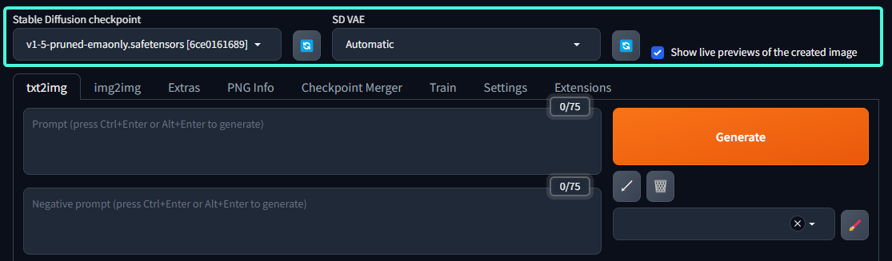
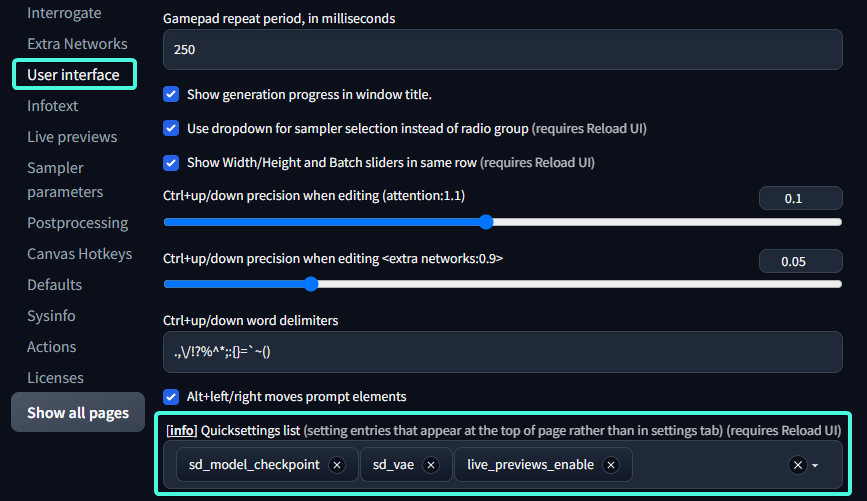
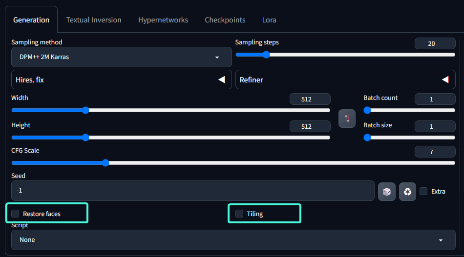
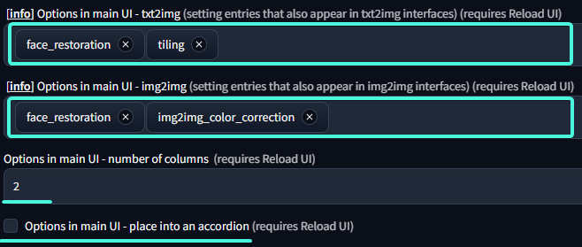
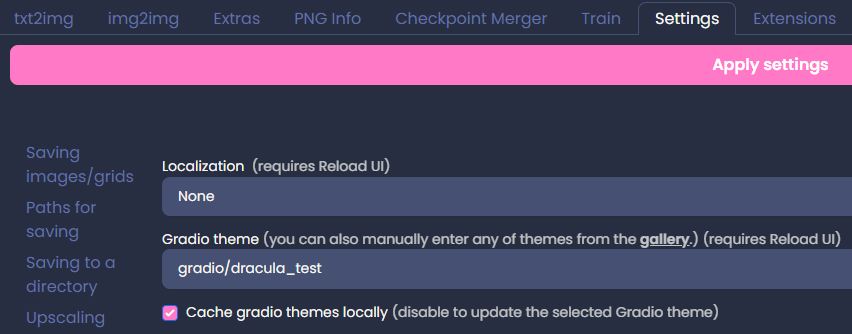
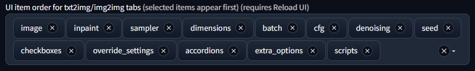
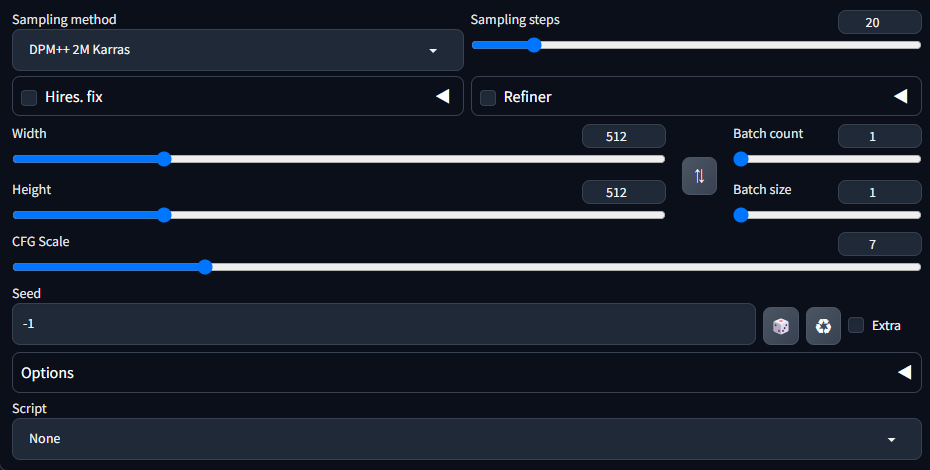
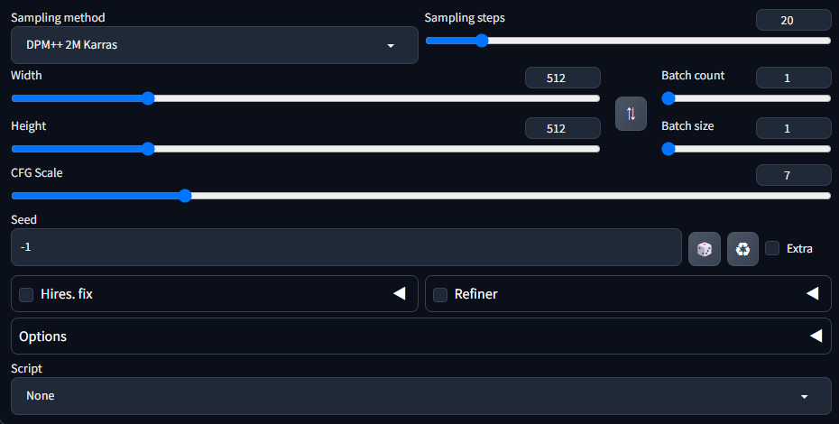

## Quick Settings
<details><summary>The Quick Settings located at the top of the web page can be configured to your needs</summary>

`Setting User` -> `interface` -> `Quick settings list`
Any settings can be placed in the `Quick Settings`, changes to the settings hear will be immediately saved and applied and save to config.




In the example screenshots `Stable Diffusion checkpoint` `SD VAE` `Show live preview for the created images` are placed in `Quick Settings`.

By default only `Stable Diffusion checkpoint` are in `Quick Settings`.

> Even though technically all settings can be relocated to `Quick Settings`, it doesn't make sense place settings that requires reloading or restarting to take effect in `Quick Settings`


</details>


## Additional Options for txt2img / img2img
How to get `Face Restore` or `Tiling` back
<details><summary>it's possible to add additional settings to txt2img or img2img</summary>

We allows user to add additional settings to the image generation interface, the settings can be found under

`Setting User` -> `interface` -> `Options in main UI - txt2img/img2img`
most if not all settings can be added here if needed

Previously `Face Restoration` and `Tiling` are built into the interface and cannot be modified, for users that finds them useful you can add them back manually




We also support additional option to change the look of how the options is displayed

</details>

## Gradio Themes
<details><summary>Customizing the basic look of webui</summary>

It is possible to customize the look of webui without using extensions suche as [Lobe Them](https://github.com/canisminor1990/sd-webui-lobe-theme.git) or [Nevysha's Cozy Nest](https://github.com/Nevysha/Cozy-Nest.git)

this can be done via gradio themes



We provide a small list of options choose from but you can manually input other themes from [gradio/theme-gallery](https://huggingface.co/spaces/gradio/theme-gallery)
if you find one you like you can inpot the corresponding `XXX/YYY` from the url `https://huggingface.co/spaces/XXX/YYY` in to ther dropdown menu

By default webui will cache the theme locally, this is so that it doesn't have to download it every time, but there's also means that if the theme is updated you won't received the updates to the theme, if you wish to update the theme (redownload) uncheck `Cache gradio themes locally` or or delete the corresponding theme cache.

The cached theme is stored under `stable-diffusion-webui/tmp/gradio_themes/your_selected_theme.json` (the slashes is replaced by underscore)

It also possible create your own theme locally or modify the cached themes

</details>

## UI item order

<details><summary>Customizing UI item order for txt2img/img2img tabs</summary>

The generation parameter UI elements can can be rewarded using `Setting` -> `User interface` -> `UI item order for txt2img/img2img tabs`

default order (1.7)

Custom order


</details>

## UI Element dafault value and range limit step size

<details><summary>Customizing UI element values</summary>

Webui allows the user to chenge the default vaule of UI elements, elements dropdown / radio menus `checkbox` slider input boxes.

1. Adjust the UI to your desire default valuse settings
2. Go to `Setting > Defaults`.
3. CLick `View changes` you will be presented with a list of element values that you have changed.
4. Confirm if you're happy with these changes and if so click `Apply`.
5. the settings will be saved to `ui-config.json` and will be used as default vaules after the next `Reload UI` or `Restart` (not F5 webpage reload).

---

Advanced adjustments such as like change the maximum range of a slide, can also be done by editing the corresponding values in `ui-config.json`, you have to edit the file manually as there currently is no in UI method of changing these values.

finding the correct value to change might be difficult, but you can locate the correct value bye utilizing the `View changes` on `Setting > Defaults`.

for example if you wish to increase the maximum limit of the Image Width slider for txt2img.
1. reload your web page, let's make sure all element values are at their default values.
2. On txt2img tab change Image Width slider to any value that is not the default.
3. Go to `Setting > Defaults` CLick `View changes` then you should see one entry like so.

| Path | Old value | New Value |
| --- | --- | --- | 
| txt2img/Width/value | 512 | 1024 |

4. Note down the Path `txt2img/Width` without the type `value`.
5. open you `ui-config.json` and search for `txt2img/Width`.
6. you will find other value under the same path like so:
```json
    "txt2img/Width/visible": true,
    "txt2img/Width/value": 512,
    "txt2img/Width/minimum": 64,
    "txt2img/Width/maximum": 2048,
    "txt2img/Width/step": 8,
```
7. you can adjust `"txt2img/Width/maximum": 2048,` to `"txt2img/Width/maximum": 4096,` to raze the maximum range limit of the slider.
8. save `ui-config.json` and `Reload UI` or `Restart` webui the slider should be updated with the new range.

> Caution: recommended to make a backup before changing, especially if you're editing the file manually, the file can get corrupted if they syntax is incorrect.

> note: some values have hidden limitations.<br>for example stable diffusion image resolution needed to be a multiple of 8, so even though you can customize the slider `step`` size to any value it is unwise to do so as it can cause unexpected errors

</details>
