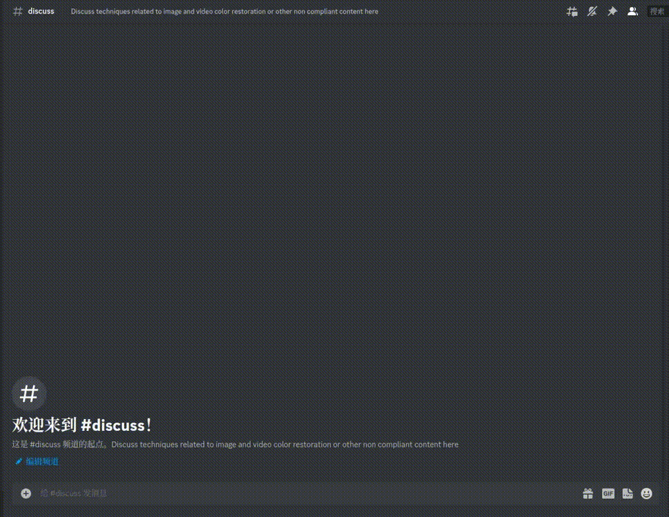

<!--
 * @Author: SpenserCai
 * @Date: 2023-07-28 14:35:35
 * @version: 
 * @LastEditors: SpenserCai
 * @LastEditTime: 2023-08-28 01:05:53
 * @Description: file content
-->

<p align="center">
  <a href="https://nonebot.dev/"></a>
</p>

<div align="center">

# DeOldify for Stable Diffusion WebUI

<a href="https://discord.gg/rfU5FQATtv">
  
</a>
  <a href="https://qun.qq.com/qqweb/qunpro/share?_wv=3&_wwv=128&appChannel=share&inviteCode=21gXfxbmZLJ&businessType=7&from=181074&biz=ka">
    
  </a>

This is an extension for StableDiffusion's [AUTOMATIC1111 web-ui](https://github.com/AUTOMATIC1111/stable-diffusion-webui) that allows colorize of old photos and old video. It is based on [deoldify](https://github.com/jantic/DeOldify).

</div>


<!--加粗字体：News-->
## News
### - 2023-08-12：The DeoldifyBot is open source, you can deploy it yourself.
### - 2023-08-11：The DeoldifyBot is onlined.You can colorize old photo in [Discord](https://discord.gg/rfU5FQATtv).
### - 2023-08-07：Support video colorization.
### - 2023-08-05：Support install from Extensions list.
### - 2023-08-04：sd-webui-deoldify released.

## Compatibility

### OS

<!--制作一个表格显示操作系统的兼容性，Windows不确定，linux兼容-->
| OS | Compatibility | Remark |
| :----: | :----: | :----: |
| Windows 11 | ✅ | Thank for [@w-e-w](https://github.com/w-e-w) test |
| Linux | ✅ | |


### Pytorch
<!--制作一个表格显示Pytorch版本的兼容性-->
| Version | Compatibility | Remark |
| :----: | :----: | :----: |
| <=1.13.1+cu117 | ✅ | |
| 2.1.0.dev20230711+rocm5.5  | ✅ | Thanks for [@fgtm2023](https://github.com/fgtm2023) test | 
| 2.0.1+cu118 | ✅ | Thank for [@w-e-w](https://github.com/w-e-w) test |

### Other
If you have tested other systems or Pytorch during use, please submit a PR and attach a screenshot of the successful operation. Thank you

## Installation
In web-ui, go to the "Extensions" tab and use this URL https://github.com/SpenserCai/sd-webui-deoldify in the "install from URL" tab.

2023-08-05：Support install from Extensions list！！！

If your network is not good, you can download the extension from [](https://huggingface.co/spensercai/DeOldify)

## Usage
1.To completely exit webui, you need to add `--disable-safe-unpickle` at startup.

2.In web-ui, go to the "Extra" tab and select "DeOldify" checkbox.

3.Upload the old photo you want to colorize.

## Application Scenario
Combining Upscale, GFPGAN, and Denoldify for old photo restoration effects

| Before | After |
| :----: | :----: |
|  |  |

## Video Colorization


<hr/>

### Usage

```bash
sudo apt install ffmpeg
```

In "DeOldify" tab, upload the video you want to colorize,set "Render Factor" and click "Run".

## DeOldifyBot

### Usage

#### 1.Add [Discord](https://discord.gg/rfU5FQATtv) Server.



#### 2.Build your own DeOldifyBot
```bash
# Instal golang
# https://golang.org/doc/install

# Enter bot directory
cd bot
# Create release directory
mkdir release
# Build
bash build.sh
# create config.json
cp ./config.example ./release/config.json
# Edit config.json
# Set your discord bot token
# Set your sd-webui address

# Run
release/DeOldifyBot
```

## TODO
- [x] Support video colorization
- [x] Improve video processing speed
- [ ] Support repair options
- [ ] Support for simultaneous generation of images with different Render Factor values and Artistic on/off like “X/Y/Z Script” [#2](https://github.com/SpenserCai/sd-webui-deoldify/issues/2)
- [ ] Support need not to add `--disable-safe-unpickle` at startup [#5](https://github.com/SpenserCai/sd-webui-deoldify/issues/5)


